Between July and August this year came a qualitatively huge leap with Sonic Pi version 5, which I reviewed and shared some code to play with ([read it here](https://edelveart.github.io/blog/sonic-pi-5-rc-first-impressions-with-what-is-love/)), and just a few hours ago, in September, **Earth, Wind, and Fire moved**, as [Sonic Pi for the Web](https://sonic-pi.net/code.html) dropped.

The first thing that came to mind after trying things out, meaning the **Sonic Pi hello world**, which would be `play 60`, as it appears in the image below.

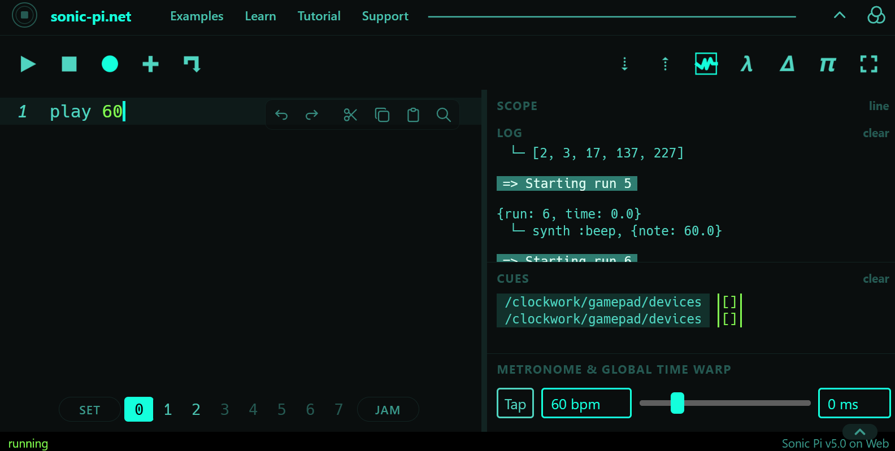

I also tried a few other classic loops in the buffers on the new website.
In fact, what I really wanted was to see if I could get at least one of my own Ruby gems working. Like in Pokémon, I picked

> [`figurate_numbers`](https://rubygems.org/gems/figurate_numbers), right here.

This post is probably the least technical and most lazy-Sunday thing I've written here (except it's actually Tuesday), and it goes straight into how to use it, so I'll briefly go over how I did it and **how you can easily use it** too.

## Prelude

My suspicion that something big was brewing in the Sonic Pi world started a few days ago, when I'd been watching some pretty long `commits` over on the repository (`dev branch`), especially this juicy [`commit c522300`](https://github.com/sonic-pi-net/sonic-pi/commit/c52230084d4255ef4c4bde9d365d78d016ac3328).

It introduces the **mruby runtime** and makes a massive shift in the **GUI** toward the versatility that comes from writing things in a web environment. Without further ado, you can read the more technical notes on capabilities and more in [a Patreon post by Sam Aaron](https://www.patreon.com/samaaron/posts/sonic-pi-on-web-170441491).

## When there's no require

To use my gem, we'd usually pull it in from the `PATH` where it was installed on the operating system. Here, right off the bat, I ran into two problems. The first is that the word `require` is a complete stranger here, and in my gem, several sequences use `require 'prime'` to compute values for p-adic methods. Let me show you a screenshot.

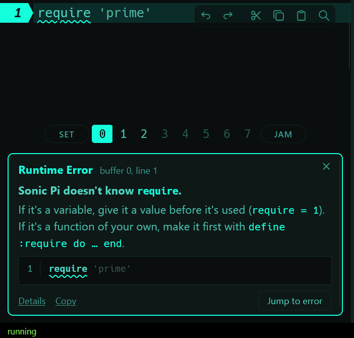

Up pops `Sonic Pi doesn't know require`, and everything comes crashing down. To cut straight to the fix, the first thing I tried was checking whether it would accept `Enumerators` defined one by one, then I also tried whether it understood `Module` hierarchies, and everything worked out fine (a bit naive, but who cares).

So I could copy the parts of my gem that didn't have any `require` straight into the buffer, bare-naked, though I'll be honest, it's a bit uncomfortable. So, I finally rewrote whatever needed `require` using a few hand-written methods, and cut and refactored a couple of little things.

Right there, as you already saw in one of the images, I clicked the **`+`** icon. Clicking it lets you load `.rb` or `.txt` files into an empty buffer. And then I thought to myself: what if I **minify** the necessary parts so I can load and use them in another buffer?

## Splitting and minifying the thing

On the [Figurate Numbers GitHub repo](https://github.com/edelveart/figurate_numbers) I decided to build 3 `tools` (simple scripts, formatted with a little help from AI) to generate two versions of my gem.
The first one is a clean, human-readable version, which I generated at [`./dist/sonic_pi_web/`](https://github.com/edelveart/figurate_numbers/tree/main/dist/sonic_pi_web), and the second one (also readable, technically), is clunkier, and it's the one I actually recommend in the README, over at [`./dist/sonic_pi_web_min`](https://github.com/edelveart/figurate_numbers/tree/main/dist/sonic_pi_web_min).

If you go into that last one, you'll find several `.rb` files, which you can and should **download**, or just click the [links in the README](https://github.com/edelveart/figurate_numbers/blob/main/README.md#how-to-use-in-sonic-pi-web) and open it in your browser.

## Load and play

Once you've loaded, say, the `plane_figurate_numbers.min.rb` file, it'll show up in your buffer like this:

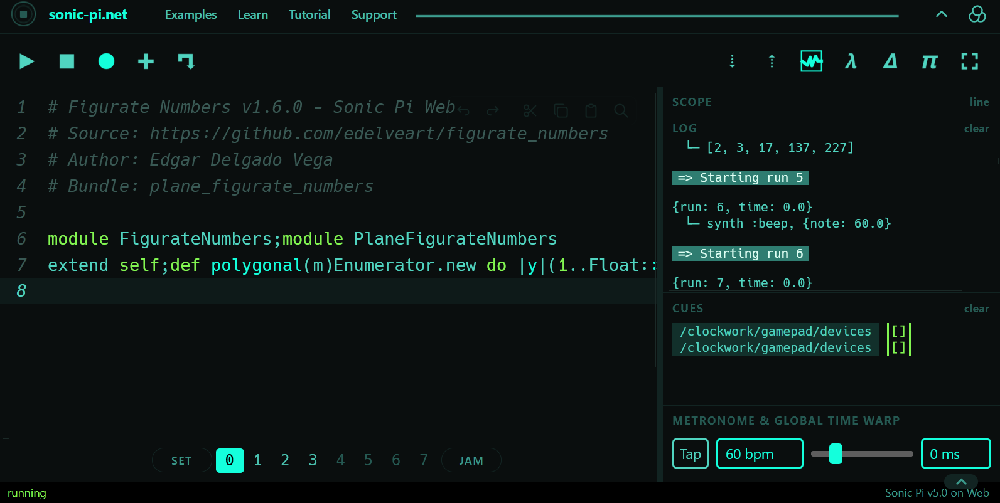

You need to hit run with `ctrl+r`, or click the `play` button. Done, now all that's left is switching buffers, and you can run things like the **examples and lists** that show up in the dropdowns in the README file. I went with the generalized pentagonal numbers for their connection to the partition function ([check out some advanced theory in my `figuratenum` docs](https://edelveart.github.io/figuratenum/advanced-theory/)).

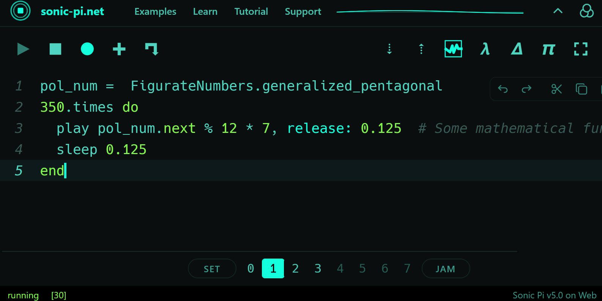

> Just dropping by to remind you that you can load any of the 4 minified bundles: `PlaneFigurateNumbers`, `SpaceFigurateNumbers`, `MultiDimensionalFigurateNumbers`, and `ArithTransforms` (the last one works by operating on and *padifying* any of the generated sequences).

## Sharing

Another one of the great things I want to mention before wrapping up is that you can share links (the same way we do every day with videos, news, or recipes). The little arrow that looks like the **old Nokia Snake game**, right next to the  `+`.

A cute little window pops up:

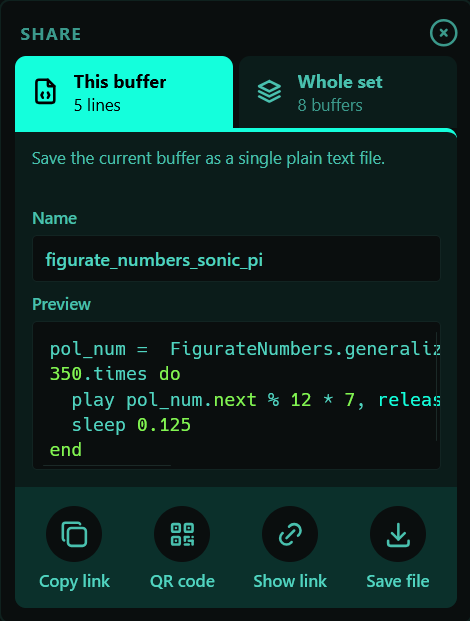

You can give your buffer a **name**, copy the link, show the **QR code** so you can place your order, or save the code as a `.txt` file for your driving test.

### Use the tiny link

The **tiny link** to my minified `plane_figurate_numbers.min.rb` is [here.](https://sonic-pi.net/code.html#code=1xV3BThsxEK36JT1ms13KLgFKAreC1EuPrXqqQglRJEIqhCpRceo_VOrn9nntWY_XdhZmUiE4eBOYN2N7xs8er_3nYrU0NYCrYN2bhT_rvSO8wsLU-7K4NLsIzHty067fsK1AuOYft_yZg_uvnTB7gy2WRbtDPM-vliDNHxY3y_nV5s3nxXKOA3MxYJirPhF-cQJa9L_mVWgsnWOjmf3CKThzH2Od63bR-868NGpyjq9fnczMoWzIfyxNkmO0Ls7bi-KQ6L8zrOjvw-MIWaoLTP_up9OPny5MNv2ruSEbttzPHx9OT0ejddUU4_Z5PG4qPE7cY_Gumf1ufwCCcc7cSnozv5s9H4Okl7Fcu5NFILPpdA7ktZc0tLUhkHng6yHWFBfqiQVPvGCnd0_0D7nSh1620z-QbXxZKvrIi3YWBKJxuLxY9LEX7QwIRONUD7Ho9160M6BX2ZgayKWfeOnOhlBxEDi58HrfS3dm9L1QJb724p0doXgMveZAFTmA98qKbIndU4XAfJTMidxUBcB8lcyJnVWFwDyWzIlcVgXA_JbMiRxXBcC8l6wJAFbfN5imSKUzByZTIukruLEcgTkx2RIjXK2k8hvmxmRNLN9MHaUAzJHJmASAcWcxBHNlsieGUA23DfNlsijV0PJxt-EDb8qZHYJi-G2YN5NBMYRmFG6YO5NBMYJmMG6YP5M9EftrF5bFCMynyZ4AwVwnYLZj4V4eBdFkHcoVy5AedjBS3sm9wiHUTjyWUcwF7itklEHO-0gcXOU1rL-5Ys5GheckKpLMDBEUnsM6nSvmDFF4DwsArpg0ROM9bDBxxZwdijE30erpBlGRW04QqZw1RsN0WUhzxZ4btdmnJFYvWOyMTA4EDC03TvT2VAPqCTJnl08IEAosFtNdMR8kdkY3nxAqFFgJX86FC5VFnIAOBA0Nl-bzSSonDVJTas5IqbzNIjm7TsaorE0aks3p6UB0UPPtYObcZxYRko52c8Y6ECHUDDwZYusiD6Wh4pzGDsQJNSsP1gk6apE1TEXPWbSgcnaY0jL15PiRtGstX3ReewxX7NmDdA-W5Z-vvhVrF5y91pZSIA-_QLYNe3Ow4cvKt19ssFfC7Ci0n9kVdTizEL1s74_HtUROi_ARd4rjF7f6bzZ3bAaHXW8ZSGTZt89HbP2x9jFnlIuJcnXgJc1_IVP9zU1o5Ev0RdQelLRAbl7SfRK9JySPfu5lDvTo8iMdqE8UmIcdc_El0ryyzuvqq2LCsO_ktj2qf1fz4qKih4Ir7XHECRkffIHRLf6WkxSI1L1DEFq5K4OVCsLwlBrHaAh6WV0iTPFJakc2JoWPVbbDJVBtdMzok9FU1cacgR34hajyeGvlSJubD3-0slaebG8HVWqOO51foirrZCfexRJIqj7LmsJjv90BtB3fRIb2vUh7lCINnm9vFtf3drfa2X6ik-JW27H_k735JTYYPiXZyvO61Trosj1NfLOMAl3WZ4eJSvv_-nRV1lfn6EXUCcPI85prSJdBGhS0Uxszw0rZQYWkGZP5yWxMcJsPUhsT8E-pj896z9NpclfDPw)

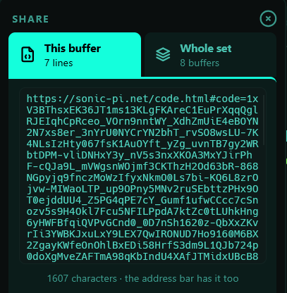

Just a tiny $1607$-character string. Still $122$ characters short of the Hardy–Ramanujan number.
Nothing to worry about.

### Use the easy draw QR

And its QR code, which I should be able to draw by hand in about half a century.

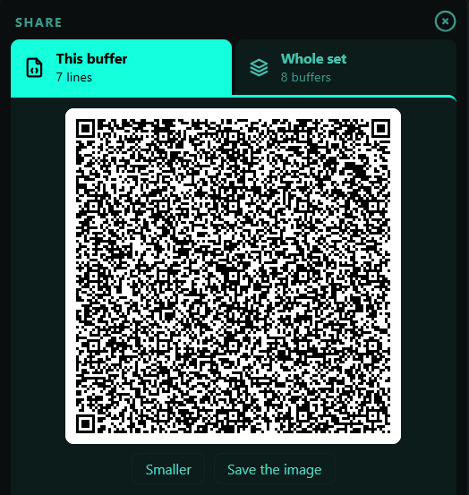

Guess which bundles in my library won't let you see their QR code, even minified:

> This program is too big for a QR code a phone can read: copy the link or save it as a file instead.

## Piano roll and other little things

Missed your DAW environment? Well, this new GUI comes with a **Piano roll** so you can feel right at home.
Clicking on the little chocolate bars will immediately take you to the corresponding line of code in the buffer.

Still no way to **quantize notes with mouse gestures** yet, though.

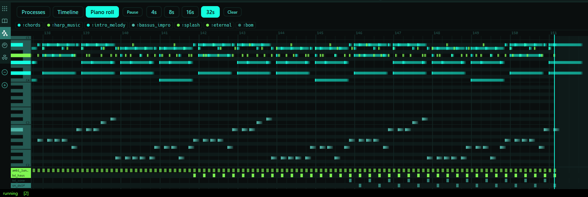

Well, a lot of the work here comes from the `SuperSonic` runtime engine.
It also shows the process nodes, just like the installable version, and introduces a new **Timeline** section.

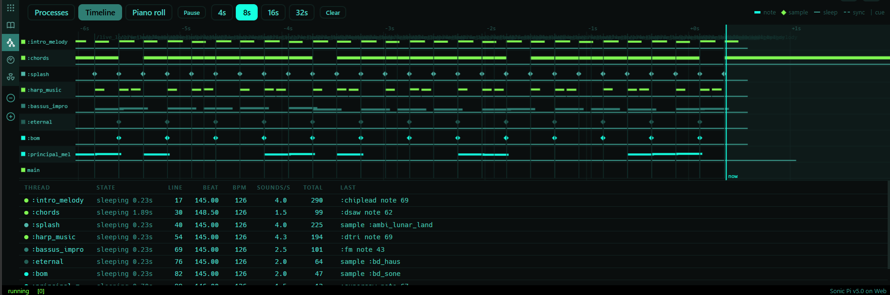

## A Few Things I Noticed

I also noticed a tiny issue in the documentation: some longer synth names (`Sc808 Closed Hihat`) overlap slightly. It's a very minor visual glitch.

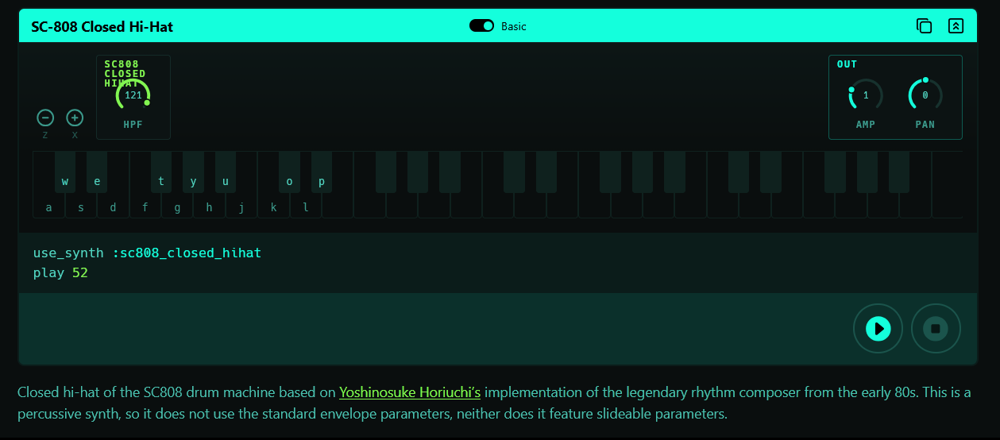

## Before we go, another QR for you

Before I say goodbye, I want to share once again my version of **What Is Love** by Haddaway.

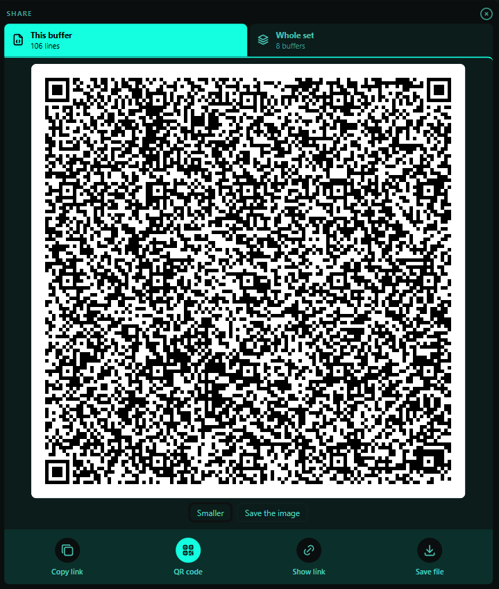

I'll be uploading another one of my favorite tracks in a future post, and I'll share it with you too.

Well, this is a great new possibility for browser-based tech, for the benefit of the community and everyone looking for a practically instant way into live coding.
I'll leave the thread about this web launch right here: [Sonic Pi now runs in the web](https://in-thread.sonic-pi.net/t/sonic-pi-now-runs-in-the-web/10058/3).

Don't forget to drop a twinkly little star on my [repo](https://github.com/edelveart/figurate_numbers/), so I can keep smashing `require` blocks like Mario Bros, for this Sonic Pi Web surprise we just got.
