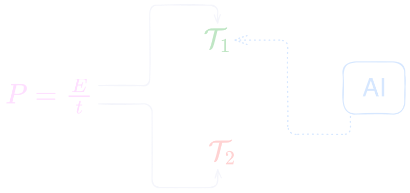

 Una de las muchas notas que escribo y no publico inmediatamente. Hice el primer esbozo el 15 de agosto y subí a una red social unos fragmentos el último día del mismo mes.

Estos **días azules** en que nos alejamos del invierno que no sucedió el presente año y aún con días de tez alternante como un grupo en el cielo tardío de agosto, estuve reflexionando sobre dos cuestiones que tienen el mismo máximo común divisor: por qué escribo notas y por qué desarrollo [librerías de software](https://edelveart.github.io/projects/).

La **inteligencia artificial (IA)** produjo, en las últimas semanas, varios resultados catalogados como importantes por la comunidad matemática, como el de la conjetura jacobiana para $n \ge 3$. Específicamente, Levent Alpöge, exestudiante de doctorado de Manjul Bhargava, puso sobre la mesa del domingo un contraejemplo con la ayuda de estas herramientas.

Casi de inmediato, en setiembre de 2026, salió la noticia de Navier-Stokes (cuya solución aún no ha sido verificada a la vieja usanza). A escasas horas, escuchamos muchas voces principales en el coro de esta comunidad dar sus notas sobre el avance y la problemática (véase [*A Severe Misalignment of AI in Mathematics*](https://zenodo.org/records/22737751)). Y, como para dar aleatoriedad al contrapunto de especies moderno, otras comunidades científicas, líderes tecnológicos e investigadores han ido en direcciones contrarias, directas, paralelas y oblicuas.

Con todo lo visto, podemos decir que la IA comienza a demostrar o contradecir afirmaciones en el laboratorio del juego formal de problemas grandes por excelencia.

Bien, esta nota trata sobre mi forma actual de trabajar con IA y surge a partir de las muchas preguntas que se han planteado en varias ramas científicas, pero la orientaré hacia lo inmediato mío.

## Velocidad y sabores

Antes de comenzar, es menester mencionarles que, como muchos de los que fuimos a la escuela básica, solía pensar que en matemáticas se trataba de hacer puros cálculos, lo más rápido posible y sin fallar.
Luego, con alguito de experiencia (digo experiencia por leer libros y artículos, asistir a conferencias y charlas), nos enteramos de que en matemáticas se resuelven problemas de muy diversa índole y, por otro lado (un gran lado), también se crean teorías.
A veces para disolver un problema y, a veces, de ellas mismas devienen nuevas problemáticas y nuevas teorías.
La novedad es que ahora las resoluciones se hacen en un tiempo reducido y la creación de nuevas teorías, no necesariamente interesantes y fructíferas, también se acelera. Pero detrás de ello está, para mí, el **aprendizaje**, la palabra del bote de tintura humano.

En el caso computacional suceden eventos similares. Muchas veces me pregunto si debería producir software más raudo, especialmente ahora que las herramientas de IA permiten generar código a una velocidad de **cien veces mayor** que la de las líneas por segundo que uno produciría normalmente a mano o en el teclado.
Una circunstancia que pocos años atrás se habría tomado por inaudita.

Hasta la fecha, sé que demoro más en desarrollar una nueva funcionalidad, añadir interactividad o gráficos a una de mis librerías, o dar por trazada finalmente la silueta de un algoritmo o una idea, si me comparo con quienes elaboran toda una arquitectura especializada para operar con agentes.

> Pero, si vuelvo a la pregunta anterior, mi **punto de fusión** es que me gusta tener las cosas en mi memoria de trabajo, de acceso rápido.

Si alguien me pregunta por tal o cual idea o algoritmo, me entusiasma poder responder y, si es posible, darles representación en diferentes sabores de un plato codificado: recursivo, memoizado, recursión de cola, tabulado, iterativo, en tipos, sonificado.

Tal ejercicio lo he hecho con múltiples algoritmos para generar secuencias de teoría elemental de números que mantengo en un repositorio privado. ¿Cuándo los lanzaré al público? En el momento menos esperado.

## Aprendizaje y producción

Para mí, la velocidad es como una flecha que a veces acierta y a veces no en la **diana del aprendizaje**.

Naturalmente, para generar algo matemático o musical en formato de nota, apunte, código o sonido, bien valdría usar la arquitectura adecuada para IA, como dije y extiendo aquí: los archivos `.md` precisamente creados, el **pipeline** en ajuste óptimo para la eficiencia de determinado objetivo. Y dicho algo funcionará, **sí y solo si** se incluye como soporte al edificio una miríada de `tests`, con toda la completitud que ni la matemática podría cerrar en sí misma.

El resultado es una demostración de algún lema o teorema formalizado en **Lean**. Con estas herramientas, bien podríamos y, muy probablemente, podremos llegar a resolver un problema muy complejo o con cotas de abstracción considerables, con un entendimiento somero de cómo se llegó a él, cómo se hilaron los argumentos para dar con tal solución.

<!-- Es decir, también probablemente nosotros perdamos reproducibilidad de la formalización a nivel de entendimiento (este punto lo tocaré quizás en otro momento). -->

No obstante, creo que la dicotomía germina aquí. Un experto puede abordar con suficiente confianza y concreción algún problema, posteriormente verificar también por cuenta propia la demostración armada por herramientas de IA y, por último, reconstruir la prueba a mano, hablarla o interpretarla (como hacen los músicos).

Por su lado, el principiante puede llegar intuitivamente a la pregunta bajo luces adecuadas (como quien atina con la iluminación en una fiesta) y tener la demostración, sin necesidad de entender cómo cruzó de un solo salto largo el cañón durante la noche de un lunes.

Cabe preguntarnos ahora: ¿qué tanto perdemos si solamente nos quedamos con el verdadero o falso de una proposición, teorema o conjetura verificada? ¿Basta con el valor de verdad de $P$, $T$ o $C$ sin tener una representación en la memoria de raudo acceso?

Pienso que, si hago eso, despojo a la matemática, al código y, en general, al pensamiento de una cualidad que también creo que comparte con la música: **el tiempo**. Exageraré con la siguiente pregunta, pero:

> ¿Tendría aún sentido comprimir en el eje temporal los seis conciertos de Brandeburgo y escucharlos en **dos minutos** si aumentamos extremadamente la velocidad de reproducción del `.wav`?

En segundo lugar, necesito entender por qué funciona una línea de código, qué abstracción estoy construyendo para no incurrir en excesos de sobreingeniería.

Por suerte, me gusta tener los cálculos bastante optimizados y me controlo para no ser un optimizador sin descanso, soñando con un $O(n) \mapsto O(1)$ en tiempo y en espacio para todo el código.

## Delegación de tipos de artefactos

¿Qué artefacto quiero construir? Es mi pregunta inicial para bordear el problema de qué mantener en control artesanal. Algunas cuestiones son directas de deducir. Si es conocimiento general, bastará con usar herramientas de IA, leer y verificar lo expuesto (artefactos tipo $1$).

Si, por el contrario, involucra conceptos que quiero tener en memoria para dibujar nodos de abstracción entre ideas, lo haré a mano (artefactos tipo $2$).

En cualquier estrategia, siempre necesito precisar qué consecuencias tiene una decisión y, al menos, un par de representaciones diferentes, para determinar qué solución es preferible a otra.

### Tipo 1

Mi lista impositiva para artefactos de tipo $1$ al día de hoy es:

- Código auxiliar, algoritmos matemáticos y estructuras de conocimiento general en software.
- Estructuras ya conocidas en un par de abstracciones en un nuevo lenguaje y replicables a cientos de ejemplos (`Enumerators`, `Yielders` en diversos sabores).
- Plantillas para tests.
- Mejora de documentación técnica y `scripts` de generación de la misma.
- Interfaz de usuario como en esta página web (algunas cosas las hago a mano aún).
- Corrección gramatical y *typos* en inglés y, en algunos casos, español.

Debo aclarar que solo me refiero a la generación, porque incluso cuando utilizo IA, como en el *script* que genera la documentación de la API en Markdown de [figuratenum](https://github.com/edelveart/figuratenum), necesito poder leer el código, verificarlo y modificarlo a mi estilo. Igual con cualquier otro artefacto generado por IA.

### Tipo 2

También hay cosas que **no voy a delegar ni un bit** de generación. Enumero los artefactos de tipo $2$ a continuación:

- Notas de blog (creación, palabras, preguntas e ideas).
- Algoritmos y sistemas de cualquier otro tema de nivel de investigación; incluyo primero inteligencia artificial y, en otros ámbitos, computación cuántica, robótica y *DSP*.
- Algoritmos especializados (como los de teoría de números figurados, formas modulares y curvas elípticas).
- Live coding con Sonic Pi, Strudel y otros entornos de codificación musical en vivo.
- Detección de erratas en libros y revisión de artículos de investigación.

### Optimización

Lo que no delego es porque me gusta construir argumentos, conservar en memoria, abstraer, crear música algorítmica en vivo o en diferido y mantenerme en constante aprendizaje de sistemas y relaciones. Lo interesante es que luego la mente, con natural agilidad, camina con buena autonomía.

Para culminar la sección, los de tipo $1$ son tareas que bien podría hacer yo si tuviera la variable tiempo $t$ a discreción. Pero $t$ no está a discreción y, por ello, debo decidir dónde poner los *watts* de  potencia mental $P$, pues al final $E = Pt$, donde $E$ es la energía mental invertida en joules.

## Síntesis aditiva

Tal vez todo esto sea un eco de haber escrito aquellas cosas llamadas versos. Solo cuando una abstracción forma parte de mí con tanta naturalidad puedo escribirla y hablar sobre ella.

Quizá por eso mis proyectos avanzan lentamente en líneas de código y mucho más hacia otra dirección, es decir, en la memoria que llevo a todas partes y en este blog. De cierta manera, aquello que construyo posee una parte de mí.

En síntesis aditiva, diré:

> Cada línea de código, cada fórmula, cada idea, cada ecuación que sea del tipo $2$ tengo que incorporarla a mis manos y a mi mente como una pieza musical que he practicado durante años y que puedo tocar con la guitarra a la espalda y, acaso, sobre una bicicleta.

