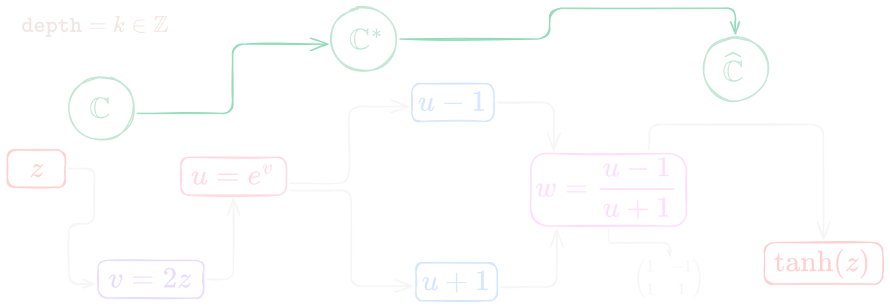

Es un título de electricista, pero planeo escribir unas cuantas cuestiones sobre cómo atisbo la variable compleja $\mathbb{C}$, cálculo en el sentido más elemental.

> Me gustan las ideas simples y que se repiten como una especie de canon por imitación directa a un intervalo cualquiera, solo variando la voz.

Veremos cosas, como las que incluí en la versión `3` de mi librería [figuratenum](https://pypi.org/project/figuratenum/), que fue la técnica de coloración de dominio (*phase portraits* en inglés), que por causalidades del sino coinciden con lo que traeré a la maleza.

Antes de pasar al siguiente nivel de Mario Bros en el frame $19$, es deber mío confesar que esta serie nació porque me volví a encontrar una función ($\tanh$) que tiene algunos niveles secretos (realmente son muy sabidos), pero puede dar algo de reverberación a cómo suelo degustar la geometría compleja.

## De los reales a los complejos

Me suena muy natural a mí pensar en variable compleja como un paso del trazado, deformación y movimiento de una línea en $\mathbb{R}$, hacia pensar el pintado, movimiento y deformación de todo un plano. Es un cambio prácticamente minúsculo, pero trae consecuencias imprevistas (como en *Half-Life*).

> La pintura dicta muchas ideas.

Asimismo, uno que se ha pasado muchas horas realizando estiramientos, rotaciones, reflexiones, inversiones, entre otros procedimientos habituales en la **música**, de escalas o acordes, veo que:

> Cada función del plano complejo parece ser una especie de ejercicio contrapuntístico de objetos que no suenan (al menos no si lo queremos) llamados funciones complejas $\vartheta(z)$.

Usaré esta notación diferente, que no significa nada más que $f(z)$, pero cuyo motivo es que la asociaremos mentalmente a un procedimiento, una secuencia de transformaciones y no a una función estática.

Así, cualquier función compleja $\vartheta(z)$ es una cadena de funciones que la construyen en el trayecto

$$
\vartheta_1 \rightarrow \vartheta_2 \rightarrow \vartheta_3 \rightarrow \cdots
$$

A su vez, pienso que la función, por ejemplo, $\tanh(z)$ que veremos en un momento, es un **estado detenido** de esta cadena infinita de posibles transformaciones.

<!-- > De cierta forma, esto tiene mucho de la visión de Teoría Transformacional Neo-Riemanniana. -->

## La señal también es un plano

Pienso más en transformaciones una tras otra, que también pueden describirse, sin duda, como composición de funciones. Sin embargo, no solo pienso en ellas de esa manera, sino más bien como circuitos eléctricos (cosa muy rara, pero natural, por ejemplo, si pensamos en cables a lo [Pure Data](https://puredata.info/) en síntesis de sonido).

Entonces, cada conexión va mutando la señal (en este caso, todo el plano complejo). De esta manera, también $\vartheta(z)$ es un circuito. No obstante, aquí no la pienso para facilitar las cosas dividiéndolas en partes más simples, sino porque me es un atisbo más espontáneo.

## La tangente hiperbólica de Sonic Pi

En una [nota anterior](https://edelveart.github.io/blog/ensalada-real-de-la-tangente-hiperbolica-de-sonic-pi/) esbocé en carboncillo sobre $\tanh(x)$ real. Aquí la visión global será lo esclarecedor (o todo lo contrario).

> Por motivos de hacerlo más corto, escribiré $z$ como si fuera algo puntual, pero debemos entenderlo como algo a nivel global del plano.

Comenzó simplemente con un $z = x + iy \in \mathbb{C}$. Y voy a enviarlo primero a $v=2z=2x+2iy$. Entonces, los puntos se alejan del origen el doble.
Ya tenemos homotecia de razón $2$ (ojo: no cambiaron los ángulos ni las direcciones).
Bien, la siguiente transformación es enviar

$$
v= 2z \mapsto u=e^{2z} = e^{v}.
$$

De lo cual deducimos, por la fórmula de Euler, que $u=e^{2x}e^{2iy}$ y por ende tenemos

$$
|u|=e^{2x}
$$
y el argumento queda como
$$
\arg(u)=2y \pmod{2\pi}.
$$

Si $x=\kappa$ es constante, es decir, si tomamos una recta vertical del plano, entonces $ |u|=e^{2\kappa}$,
que es constante. En consecuencia, la recta vertical se transforma en un círculo centrado en el origen.

Por otra parte, si $y=\kappa$ es constante, entonces
$ \arg(u)=2\kappa$, que también es constante (vaya coincidencia).
Así, una recta horizontal se transforma en un rayo que sale del origen.

> Memorial oportuno: la función $e^{2z}$ tiene período $\pi i$, pues $ e^{2(z+\pi i)} = e^{2z+2\pi i}=  e^{2z}$.

Si pensamos en una cuadrícula, esta se pone malta polar (círculos concéntricos y rayos). Bien, llevamos dos cables en la cadena.

## Möbius

Ahora, el siguiente y tercer cable le hacemos pasar la señal mapa $u$ y retorna un $w$ que se define como

$$
w=\frac{u-1}{u+1}.
$$

Si nos detenemos a observar un instante, esto se trata de una transformación de Möbius

$$
m(u)=\frac{au+b}{cu+d}
=
\frac{u-1}{u+1}.
$$

Lo que nos susurra que los coeficientes son

$$
a = c= d= 1,\quad b= -1.
$$

Lo exigido aquí es que el determinante de la matriz asociada a la función debe ser **diferente** de $0$.
Si lo calculamos tendrás un feliz $2$:

$$
\det
\begin{pmatrix}
1 & -1\\
1 & 1
\end{pmatrix}
=
1\cdot1-(-1)\cdot1
=
2.
$$
Perfecto, pasamos el tobogán y caímos en suave arena. Desde la geometría, lo que sucede es que esta transformación manda círculos y rectas en círculos y rectas.

¿Listo? Lo que hemos hecho es trotar entre cuatro espacios: plano $z$, plano $v$, plano $u$, y plano $w$.

## Salta el corazón al plano $w$

¿El plano $w$ qué es? Es un estado de detenimiento de transformaciones y es justamente, $\tanh(z)$.

<!-- $$
Tal vez...
z
\ \mapsto\
v=2z
\ \mapsto\
u=e^{v}
\ \mapsto\
w=\frac{u-1}{u+1}
=
\tanh z.
$$ -->

Arriba, trazé el tránsito de espacios asociados al circuito principal de transformaciones.
Como hicimos este proceso, volvemos a pensar en $\vartheta(z)$ y preguntarnos:

> ¿Cuántas funciones más elementales son las óptimas para divisar la estela de $\vartheta(z)$?

Podríamos, en una primera lectura a primera vista, arrojarle una medida `depth=3`. Por otra parte, también la función naturalmente es $\tanh(z)$, con un `depth=0` cuando la vemos directamente.

O, ¿qué pasaría si descomponemos en dos exponenciales? ¿Es `depth=2` o `depth=1`?

Frente a las preguntas, cabríamos esperar también la reducción a un patrón (vuelvo nuevamente a la idea de iteración). Mi pregunta natural es:

> ¿Existe alguna composición de  mapeos complejos  (con un aroma aritmético) $T$ base que pueda iterarse simplemente y detenerse en esta función $\tanh(z)$ de manera natural?

Conviene parar nuestro coche nuevamente y cuestionarnos o elaborar algo más formal para establecer **qué entendemos por natural**. Al respecto, ese operador aritmético elemental quizás pudiera generar una familia bella de funciones.

Es más, iría un tramo de la panamericana más lejos. Una vez pensada con algo más de tiempo la idea de profundidad, me pregunto:

> Si existe ese tal $T$, ¿cuál es el momento congelado más natural (función) de la cadena infinita de transformaciones $\vartheta_j$?

