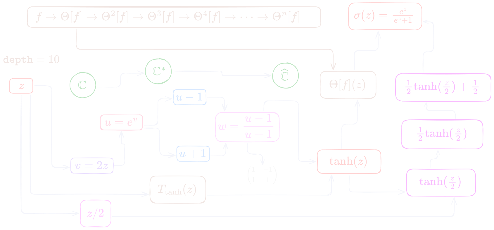

La [nota anterior](https://edelveart.github.io/blog/circuiteria-de-variable-compleja-i/) trató sobre la posible existencia de un operador $\Theta$, que inicialmente pensé como un **parámetro u objeto** que, en el mejor sentido de la iteración, permaneciera.

Y para serte sincero, Baki, la verdad es que esa pregunta me surgió con la función
**sigmoide**, luego de revisar el efecto `with_fx :tanh` en Sonic Pi, tan en boga en los últimos años con el auge público de la inteligencia artificial, que veremos en esta nota.

Habíamos construido explícitamente este circuito de transformaciones con su punto de conexión:

$$
\mathbb{C}
  \xrightarrow{\quad z \mapsto e^{2z}\quad}
\mathbb{C}^{*}
   \xrightarrow{\quad u \mapsto \dfrac{u-1}{u+1}\quad}
 \widehat{\mathbb{C}},
$$

donde $\mathbb{C}^{*} = \mathbb{C}\setminus\{0\}$ y
$\widehat{\mathbb{C}} = \mathbb{C}\cup\{\infty\}$.
Sobre el último espacio tendremos la tercera nota de esta serie.

> En efecto, es $\tanh(z) = \frac{e^{2z}-1}{e^{2z}+1}$, casi **cinemategráfica**.

## Sigmoide a la cartomancia

Cuando queremos hacer que las cosas se vean como probabilidad, necesitamos que caigan en el rango entre el buen $0$ y el primario $1$, para que active nuestro cableado neuronal. Es muy común soltar de tu baraja real $\mathbb{R}$ esta carta:

$$
\sigma(x) = \frac{1}{1+e^{-x}}
$$

Funciona bien para problemas binarios
($\sigma: \mathbb{R}\rightarrow (0,1) $), pero con patrañas por el gradiente para valores enormes o pequeños, foco que no es asunto nuestro, por ahora.

Bien, es momento de cambiar a baraja compleja $\mathbb{C}$ (ya contamos con polos y ceros para la siguiente nota de esta serie), ya tuvimos una entrada del menú.

## Circuitería necesaria

Retomemos la cadena de transformaciones que desemboca cual Rímac en la función $\vartheta_1 = \tanh(z)$. Con estos nuevos cables que conectaremos a continuación, haremos que su `depth` se incremente (revisa la nota anterior si te parece raro lo dicho).

> Aquí podemos pensar de dos maneras: que ya estamos en la tangente hiperbólica donde nos quedamos, o desde una nueva función comenzando en $z$. Probemos la primera mencionada, que es la transformación de la función $\tanh(z)$.

Comencemos dividiendo el argumento entre dos, $\tanh(\frac{z}{2})$. La geometría produce una similitud directa de razón $\frac{1}{2}$ (contracción del **plano de entrada**) que fija el origen. De hecho, solo estamos cambiando qué punto del plano $z$ le damos a $\tanh(z)$.

El siguiente cable, por coincidencias de la vida, es nuevamente una contracción geométrica del plano de salida. Con lo que pasamos la señal hacia

$$
\tanh\left(\frac{z}{2}\right)
 \mapsto \frac{1}{2}\tanh\left(\frac{z}{2}\right).
$$

Finalmente, el último cable, la geometría de salida combina una contracción de razón $\frac{1}{2}$ con una traslación hacia la derecha y, por los misterios de la vida (fíjate), nuevamente tenemos

$$
\frac{1}{2}\tanh\left(\frac{z}{2}\right)
\mapsto
 \frac{1}{2}\tanh\left(\frac{z}{2}\right) + \frac{1}{2}.
$$

## Sube la sigmoide lentamente

Hemos transformado $\tanh(z)$ en una sigmoide moviendo el bote. Recordemos la observación más arriba expresada en exponenciales complejas como

$$
\tanh\left(\frac{z}{2}\right)= \frac{e^{z}-1}{e^{z}+1}.
$$

Posteriormente, le untamos la mantequilla

$$
\sigma(z) = \frac{1}{2}\frac{e^{z}-1}{e^{z}+1} + \frac{1}{2}
$$

y juntamos las dos tapitas del pan con cuidado

$$
\sigma(z) = \frac{e^{z}-1+e^z + 1}{2(e^z + 1)}.
$$

Por último, simplificamos luego de vuelta y vuelta en el centro de Lima como

$$
\sigma(z) = \frac{e^z}{e^z + 1} = \frac{1}{1+e^{-z}}.
$$

Al final, fue una cadena de eventos imprevistos de la división y ya se te hizo conocido, ¿verdad?

## Mapeos y operadores en el circuito

Ya notaste que el operador $\Theta$ tiene el parámetro $\frac{1}{2}$, la **pieza clavícula** de todo esto.
Ahora nuestra cadena infinita toma un nuevo punto congelado interesante (para cuestiones de ingeniería).

Tenemos, entonces, la transformación no lineal $\vartheta_1 = \tanh(z)$.
Esta proviene de los mapeos complejos con funciones elementales
$T_1(z) = 2z$, $T_2(z)=e^{z}$, $T_3(z) = \frac{z-1}{z+1}$, y lo componemos:

$$
T_{\tanh}(z) = T_3 \circ T_2 \circ T_1.
$$

Por su ruta, la sigmoide $\vartheta_2 = \sigma(z)$ proviene del operador geométrico aplicado a $T_{\tanh}$ y, si lo aislamos para llevárnoslo a trabajar
sobre otras funciones, queda como

$$
\Theta[f](z) = \frac{1}{2} f\left(\frac{z}{2}\right) + \frac{1}{2}.
$$

¿La profundidad? Y aunque falta mucho por pensar y dejar lo ingenuo, con todas las cien preguntas que puedes hacer, por el momento, tomaremos profundidad `depth: k` en enteros como el número de transformaciones.

Observa el gráfico ahora (introduzco también el camino desde cero, cuando empezamos en $z$, y ahí utilizamos $\tanh(z)$ como lo fue la exponencia $e^{z}$ en el circuito).

Si contamos el circuito con el mayor número de estados congelados hasta llegar a la sigmoide, tenemos $k=10$. Incluso, podríamos también contar el cableado, como cuando vamos a la sala de ensayo y no podemos conectar nuestros efectos. ¿Y esos operadores $\Theta$ que están arriba?

## Afín a nosotros

Lo que quiero ahora es abstraer nuevamente el operador $\Theta$ para iterarlo. Lo pienso como un par de transformaciones afines:

$$
A(z)= \frac{z}{2}, \quad B(z)= \frac{z+1}{2}.
$$

Por ende, tenemos una acción que modifica simultáneamente la entrada y la salida de la función que lancemos $f$. De esta manera, mantenemos esta **toma para nuestro álbum** (quito $z$ por abuso de no querer escribirla),

$$
\Theta[f] = B \circ f \circ A.
$$

> Con esto sale al ojo sin Baldor: $\Theta[\tanh] = \sigma$.

Con ella, es fácil iterar con toda naturalidad. Para $n\geq 1$,

$$
\Theta^n[f] = B^n \circ f \circ A^n.
$$

Para que no nos chispoteemos otra vez, escribimos $z$:

$$
\Theta^n[f](z) = 2^{-n}f(2^{-n}z) + (1 - 2^{-n}).
$$

## Sin límites

Usualmente no me gustan mucho las cosas al infinito (realmente no las puedo palpar ni respirar cuando $n \rightarrow \infty$), pero lo pondré por puro análisis elemental. Hay dos límites: el primero es $2^{-n} \rightarrow 0$, y $2^{-n}z \rightarrow 0$. Bien, supongamos que $f$ **es continua** en $0$.

Luego, $f(2^{-n}z) \rightarrow f(0)$, que a su vez está multiplicado por $2^{-n}$, así que todo conduce a cero. Pero el término $1-2^{-n} \rightarrow 1$. Así que este último es lo que detiene el instante de convergencia puntual ($z$ fijo):

$$
\lim_{n \rightarrow \infty}\Theta^n[f](z) = 1.
$$

Perfecto. Ya que sabemos qué ocurre, vamos a escribirlo en limpio en el cuaderno Lorito (ahora que ya tenemos una posibilidad para lo invariante):

> Si restringimos $\Theta$ al espacio de funciones $f:\mathbb C\to\mathbb C$ continuas en $0$, el parámetro geométrico $\frac{1}{2}$ induce una dinámica cuyo **único punto fijo** es la función constante $1$.

Naturalmente, ya quieres cambiar la clavícula $\frac{1}{2}$. Lo que podríamos hacer inmediatamente es pensar en una familia uniparamétrica de operadores $\Theta_{\lambda}$, pero no lo veremos aquí. Es algo tarde y hay que cerrar el circuito por hoy.

