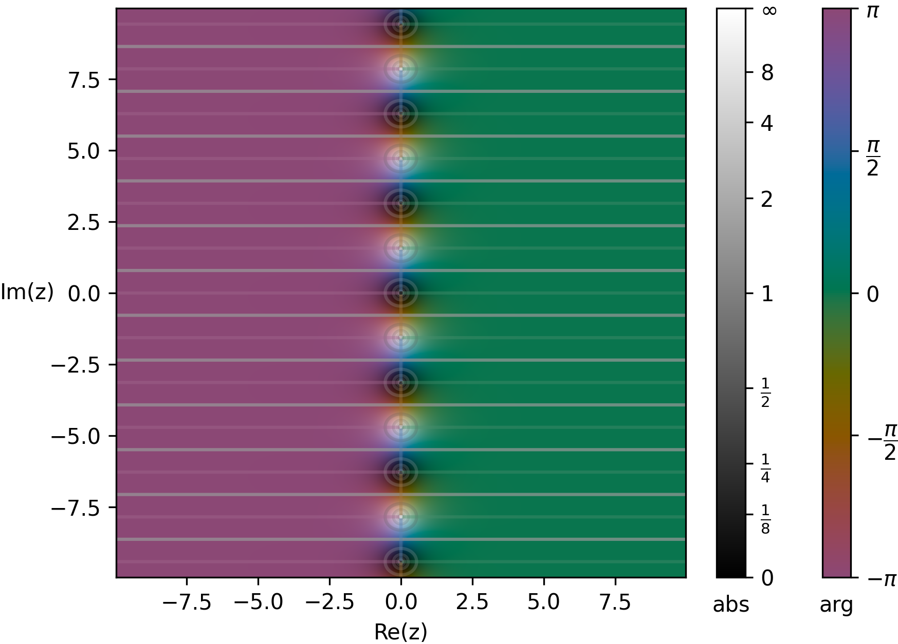
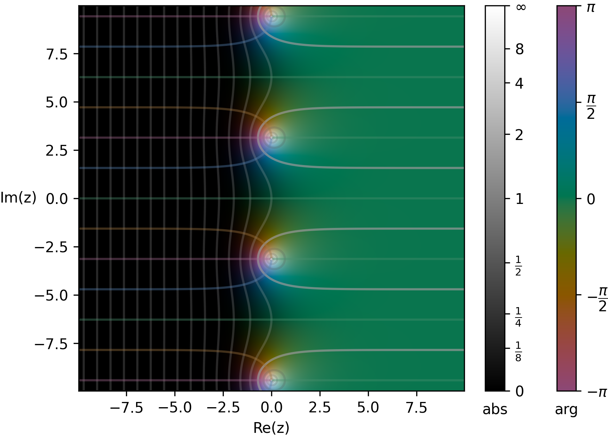
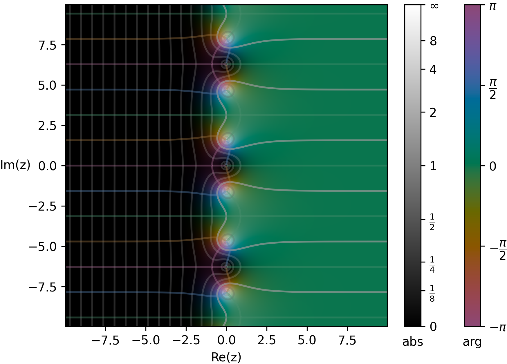

Anteriormente, propuse, de manera muy natural, iterar el operador $\Theta$ cuando $n \rightarrow \infty$, a partir de la sigmoide $\sigma$ compleja presentada en la [nota II](https://edelveart.github.io/blog/circuiteria-de-variable-compleja-ii/) de esta serie.

Y lo prometido allí fue plasmar, en la nota presente, un par de conjuntos de puntos **clásicos** asociados a las funciones complejas.
Para tal efecto sonoro, es menester comenzar nuestro recorrido con el espacio $\widehat{\mathbb{C}}$.

Desde el inicio de esta serie dije que pensaba la variable compleja como un pintado antes que como un trazado, tal como ocurre con la variable real, y esa forma de concebirla surgió después de conocer la técnica de coloración de dominio.

Al respecto, durante el verano de este año 2026, estuve desarrollando para mi librería de números figurados multidimensionales, con ya 21 mil descargas, [`figuratenum`](https://pypi.org/project/figuratenum/), un tipo de representación que Wegert (2012) describe como ***Phase Portraits*** enriquecidas. En un momento veremos eso; afila tu Python.

> Para salir del tema por un instante, es curioso cómo, desde el efecto `with_fx :tanh` de **Sonic Pi**, llegamos hasta estos lares de autumnal claror.

## Polos sin norte y sin sur

> Seleccionamos el modo

Como muchos temas de variable compleja clásica, este ha sido sumamente estudiado. En consecuencia, diré que basta con anular el denominador $e^{2z}+1=0$ de $\tanh z$ y ver qué pasa. Entonces, por memoria de algebrista, escribimos

$$
-1 = e^{i(\pi + 2\pi k)},
$$

donde $k$ es un entero. Inmediatamente dimos en el clavel arriba para obtener la ecuación

$$
2z = i(\pi + 2\pi k).
$$

Según la página perdida de Baldor, debemos dividir entre $2$, así

$$
z_k^{p} = \frac{i(\pi + 2\pi k)}{2}.
$$

De aquí sacamos $\pi$ como factor común (en mágicas palabras de Moguer, $\pi(1+2k)$). Y, por último, barajamos el mazo y ordenamos el inventario antes de iniciar la partida

$$
z_k^{p} = \frac{(2k+1)\pi i}{2}.
$$

Este conjunto $\{z_k^{p}\}$ de anulaciones, donde $e^{2z}+1$ se hace vacuidad, recibe el apodo amical de **polos**. Como hay infinitos valores enteros de $k$, tendremos infinitos polos.

Sin lugar a dudas, hay aquí un punto de sabor aritmético. Los coeficientes de $\pi i$ son precisamente números impares arriba, mientras que abajo aparece el número par por excelencia.

## Ceros en el nocturno

Vamos con el siguiente conjunto de puntos clásicos; tal vez te recuerden más a los polinomios (esa beldad de indeterminadas que terminan).
Nuevamente habrá que anular con el dedo meñique $e^{2z}-1=0$. Lo que es igual a $e^{2z}=1$.

Como se sabe en cualquier barrio, $1=e^{2\pi i k}$. Otra vez igualamos los exponentes

$$
2z=2\pi i k,
$$

y dividimos entre dos, con Baldor en mente, lo que nos lanza

$$
z_k^{(0)}=k\pi i,
$$

donde ya tú sabes qué es $k$.
Por coincidencias de toda una vida, otra vez tenemos infinitos puntos donde la función se anula, que se llaman **ceros**.

> Sí, la notación es algo recargada, solamente eso.

¿Verano listo todo este año?

## Geometría de puntos

¿Dónde están graficados estos puntos especiales $z_k^{p,0}$ en el plano complejo $z$ de la función $w=f(z)=\tanh(z)$? Como en la nostalgia del pasado, aquí sí se perdió lo real y ahora todo es imaginario.

Realmente, pero imaginariamente, tanto los ceros como los polos se alternan sobre el eje imaginario como una torre infinita. La verdad es que suena un poco poético, pero es geométricamente equivalente a tal aseveración.

Actualmente existen varias bibliotecas para graficar funciones de variable compleja, pero hubo una en especial que me llamó la atención porque emplea una paleta de **colores perceptualmente uniforme** llamada `Oklab`, presentada en **2020**. El tema nace de una bella pregunta, y pueden leerlo y probarlo en esta publicación de quien la pintó con matrices: [Björn Ottosson](https://bottosson.github.io/posts/oklab/).

¿Y cuál biblioteca usaremos con Python? Se llama `cplot`. Necesitamos solamente `numpy` para la vectorización.

```py
import numpy as np
import cplot

def complex_f(z):
    return np.tanh(z)

t = 15
graph = cplot.plot(
    complex_f,
    (-t, +t, 400),
    (-t, +t, 400),
)

graph.show()
```



### Oye cómo va la magnitud

Como dijimos, representados están en alternancia ceros y polos, los puntos.

Hay dos barras, la primera es la que representa la magnitud `abs` que es $|\tanh(z)|$. Mientras los valores son más pequeños, cae la noche, mientras son inmensos, una luz que borra tu memoria, es decir, cuando $z$ va hacia el polo, $|\tanh(z)| \rightarrow \infty$.

> Luminosidad para polos y oscuridad para ceros es algo que sale en lectura a primera vista con *phase portraits*.

### Oye cómo va la fase

La segunda barra representa el argumento $\arg(\tanh(z))$. En el centro vertical es una especie de verde, que predomina en el lado derecho del eje $\Im(z)$.
Esta fase cercana a $0$ tiene un porqué.
Cuando $\Re(z)$ aumenta, la función tangente hiperbólica se aproxima a $1$, y si le sacamos el argumento, es justamente $0$.

Un poco más protocolares, decimos

$$
\lim_{\Re(z)\rightarrow +\infty} \tanh(z)=1.
$$

Mientras tanto, al lado de la izquierda, tienes un color rosado apagado, que indica que la función tiene argumento cercano a $\pm\pi$.
En esta región se aproxima a $-1$, que tiene esas dos posibilidades, positiva o negativa, según la rama que tú elijas. El límite para este caso es calcomanía.


| Punto sobre la torre imaginaria | Papel actoral en $\tanh(z)$ |
| ------------------------------: | :-------------------------- |
|                        $3\pi i$ | Cero                        |
|              $\frac{5\pi i}{2}$ | Polo                        |
|                        $2\pi i$ | Cero                        |
|              $\frac{3\pi i}{2}$ | Polo                        |
|                         $\pi i$ | Cero                        |
|               $\frac{\pi i}{2}$ | Polo                        |
|                             $0$ | Cero                        |
|              $-\frac{\pi i}{2}$ | Polo                        |
|                        $-\pi i$ | Cero                        |
|             $-\frac{3\pi i}{2}$ | Polo                        |
|                       $-2\pi i$ | Cero                        |
|             $-\frac{5\pi i}{2}$ | Polo                        |
|                       $-3\pi i$ | Cero                        |


## Directo a la avena sigmoide

Como ya explicamos de manera ligera cómo son ambos conceptos, vamos al tono con la sigmoide. Desde el segundo capítulo de la serie, traemos al código

```python
def complex_f(z):
    return 1/2 * np.tanh(z/2) + 1/2
```



Lo primero que notamos es que parece haber demasiados ceros, pero es una trampa visual. Realmente no hay ninguno, porque el numerador $e^z \neq 0$ para todo $z$.

Ahora, en el piso inferior, tenemos $e^{i(\pi + 2\pi k)}=-1$. Al igualar, tenemos que los polos son de la forma

$$
z_k^p = (2k+1)\pi i,
$$
donde $k$ es entero nuevamente.

Si volvemos la mirada sobre los ceros, no hay ninguno. Todos los que aparecen hacia el lado izquierdo de $\Im(z)$ son valores que se aproximan mucho a cero, pero no llegan a ser cero. Como ya vimos con la tangente, aquí también tenemos el límite

$$
\lim_{\Re(z)\rightarrow-\infty}\sigma(z)=0.
$$

Por eso parece una pintura de una zona oscura aún por descubrir en *Warcraft*.

## Broche de fase

Juguemos a cancelar cosas. Dándole al producto $ \tanh(z)\sigma(z) $ se produce

$$
\tanh(z)\sigma(z)
=
\frac{e^{2z}-1}{e^{2z}+1}
\frac{e^z}{1+e^z}
=
\frac{e^z(e^z-1)}{e^{2z}+1}.
$$

Cuando dos objetos similares se encuentran, se repelen o se cancelan, desentona el dicho popular. Los polos de la sigmoide en $z=(2k+1)\pi i$ se encuentran con los ceros de $\tanh(z)$ y se cancelan.

A estos puntos especiales también se les asigna un nombre de eximia creatividad, **puntos removibles**, ¿cierto? De hecho,
$
\lim_{z\rightarrow(2k+1)\pi i}\tanh(z)\sigma(z)=1.
$

Los polos que quedan son $z_k^p=\frac{(2k+1)\pi i}{2}$, mientras que los ceros supervivientes son $z_k^{(0)}=2\pi i k$.
La torre queda bastante más limpia, pero nuestra tabla no. A fin de cuentas, ¿alguien quiere usar zapatos impares? Ya levantaron la mano por allá.


| Punto sobre la torre imaginaria | Papel actoral en $\tanh(z)\sigma(z)$ |
| ------------------------------: | :----------------------------------- |
|                        $3\pi i$ | Removible, valor $1$                 |
|              $\frac{5\pi i}{2}$ | Polo                                 |
|                        $2\pi i$ | Cero                                 |
|              $\frac{3\pi i}{2}$ | Polo                                 |
|                         $\pi i$ | Removible, valor $1$                 |
|               $\frac{\pi i}{2}$ | Polo                                 |
|                             $0$ | Cero                                 |
|              $-\frac{\pi i}{2}$ | Polo                                 |
|                        $-\pi i$ | Removible, valor $1$                 |
|             $-\frac{3\pi i}{2}$ | Polo                                 |
|                       $-2\pi i$ | Cero                                 |
|             $-\frac{5\pi i}{2}$ | Polo                                 |
|                       $-3\pi i$ | Removible, valor $1$                 |


Sonríe para la última foto, **di fase**.



Sobre esas líneas que contornean los retratos de fase en acuarela ficta tendré que decir algo, algún año.
Listo, eso es todo. Terminamos la sesión de fotografía por hoy.

