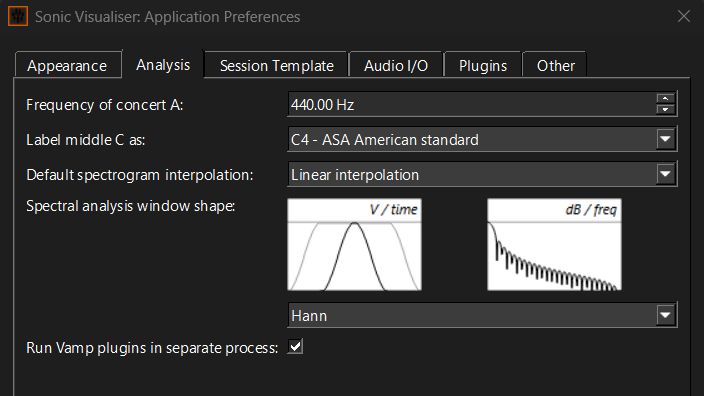
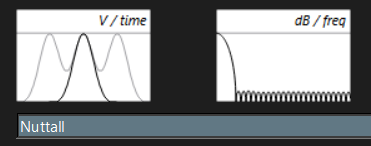

Recuerdo que una vez preguntaron (realmente lo imaginé) qué era eso de las ventanas que aparecen en [Sonic Visualiser](https://www.sonicvisualiser.org/) durante el análisis del espectro.
Desde luego, me vino a la mente la primera vez que intenté comprender de qué va esto de las ventanas en audio y por supuesto, el enfoque de tratar de meter cosas en iteraciones y bucles, como todo músico que adora los patrones.

> Muchas ventanas (Hann, Blackman, Nuttall, etc) son un combinado de chifa de cosenos.

Solamente haremos un *drag* corto, **raspando la pintura** sobre este tema (hay muchas otras ventanas, como las Gaussianas, Parzen y demás vidrios tintados especiales, más allá de las lunas cosenoidales). Me salen rimas torpes a raudales.

## ¿Qué me cuenta Sonic Visualiser?

Escucha la [Ventanita](https://www.youtube.com/watch?v=znJ1HPAGAlc) silenciosa de los Embajadores Criollos (versión `5.2.1`).
Ve al menú  `File` y luego hazle click en `Preferences` y selecciona la pestaña de temible nombre `Analysis`:

Para analizar audio digital, los algoritmos de **DSP** no toman toda la señal de golpe, sino que la dividen en pequeños bloques de queso llamados ***frames***.

El problema es que al cortar esos bloques álficos aparecen discontinuidades y abruptos en los extremos.
Como la **DFT** interpreta cada ***frame*** como un período de la señal periódica (qué repetitivos sonamos), esos saltos generan un problemilla fregado llamado **fuga espectral**, que consiste, de modo periódico, en la energía que se derrama hacia frecuencias del vecindario.

### Preludio

Por otra parte, hay un primer duelo en la Panamericana: la resolución temporal, qué tan rápido detectamos los cambios en el motor, contra la resolución frecuencial, qué tan cerca podemos estacionar dos frecuencias sin que choquen.

En otras carrocerías, lo que pasa es que un **frame** largo mira más carretera y permite separar mejor las frecuencias, pero reacciona más lento ante los cambios.
Un **frame** corto toma curvas más rápido, aunque pierde detalle para distinguir vecinos cercanos.

> Además, los frames suelen solaparse (*overlap*). Por ejemplificar, una FFT de $2048$ muestras  puede avanzar $512$ o $1024$ muestras antes de tomar la siguiente curva. Así evitamos dejar huecos en la pista. Pero esa carrera la dejamos para otra vuelta.

Para resolver el problema es que se idearon las ventanas y si te pones a leer (hay muchas, pero yo voy a tocar solo algunas que penden de SV) y parten de una idea muy antigua en trigonometría: el coseno. Y sí, estamos en **Familia** como en *Rápidos y Furiosos*.

## El coseno

> Para este par de vueltas, si has estado muy alejado de trigonometría deberás repasar u ojear algo básico. Por ejemplo, el curso corto de cálculo [Serge Lang](https://link.springer.com/book/10.1007/978-1-4613-0077-9). Recordamos que $\cos (\alpha) = \frac{x}{R} = \frac{x}{\sqrt{x^2 + y^2}} $, donde $R$ es la distancia desde el origen $\mathbb{R}^2$ hasta el punto $(x,y)$, y $x$ es obviamente la coordenada en el eje de abscisa.

Normalmente nos preguntaremos ¿por qué no hacemos las cosas con seno envés de coseno?. La respuesta fácil es, claro, una es un desfase de la otra.
También es un buen ejercicio matutino antes de un tamalito, reescribir en términos de seno lo que veremos ahora.
Recordamos por el momento, que por ahí hay una identidad que rapea  $1- \cos(2x) = 2 \sin^2(x)$. En un toque respondemos su rima.

Listo, es menester continuar la travesía de ultraventanal.

Necesitamos unos coeficientes, primero. Es simple, $a_0, a_1, \ldots, a_w$ serán números  reales (a gusto del comensal). Y nuestros ingredientes secretos son unas pizcas de **armónicos cosenoidales**:
$$
    \cos \left(\frac{2  \pi n}{N-1}\right), \cos \left(\frac{4  \pi n}{N-1}\right), \ldots
$$

Toca hablar de la totalidad de puntos en las  muestras,  a este número (es fijo por si acaso) lo denotaremos como $N$, y cada uno de los puntos que van avanzando serán $n$, es decir los índices.

Lo único que nos faltaba es armar por vez primera el sandwich $\Omega$ de **4** pisos:

$$
\begin{align*}
    \Omega(n)
    &= a_0
    - a_1 \cos\left(\frac{2\pi n}{N-1}\right) \\
    & + a_2 \cos\left(\frac{4\pi n}{N-1}\right) \\
    & - a_3 \cos\left(\frac{6\pi n}{N-1}\right) \\
    & + a_4 \cos\left(\frac{8\pi n}{N-1}\right).
\end{align*}
$$

## La gran familia

Muy probablemente ves que sigue un patrón de alternancia. ¿No se te hace curioso que estamos jugando a cambiar coeficientes? Gran parte de ventanas consiste en ello y es lo que calibra el compromiso entre fuga y resolución.

Bueno,  sucintamente lo podemos amalgamar en una sola pieza como

$$
\Omega(n) = a_0 + \sum_{t=1}^w  (-1)^{t}a_t \cos \left(\frac{2 t \pi n}{N-1}\right).
$$

Tranquilidad aquí, ese $w$, es la cantidad de términos de nuestra ventana, no exageremos con $w \ge 100$. Esta es la **evolución general**, el ancestro de toda la familia, nuestro motor V-$100$ del *Charger* de los 70.

> Un filósofo dijo que los autos tienen el mismo chasis, pero cambia cómo repartimos los *HP* entre distintos armónicos.

En fin, ya nos hicimos con la pieza de museo prehistórico (¿qué falta de respeto no?), volveremos sobre ella luego.

## Hann de rápidos y no furiosos con su sandwich de dos pisos

> Veamos el inicio de la saga $\Omega(n) = 1$, aquí pasó todo: $0 \le n \le N-1$ . Esta ventana es conocida como rectangular y todas las demás vienen despues de ella (realmente no porque no es coseno, pero es útil tomarla como punto de partida). Lo que hace es simplemente dejar intacta la amplitud de cada frame.

Por ejemplo, una muestra de audio puede tener `N=2048` puntos, pero nosotros la veremos como $N = 9$ para visualizar el comportamiento de la ventana. La primera ventanita es **Hann**. El $n$ es la posición dentro de la muestra. Necesitamos evaluar entonces para $n$ desde $0$ hasta $N-1$:

$$
\Omega(n) = \frac{1}{2} \left( 1 - \cos \left(\frac{2 \pi n}{8} \right)  \right).
$$

Soltaré a continuación la tabla de la iluminación (usa tu Casio o tu lápiz):

| Índice de muestra $n$ | Valor $\cos(\frac{2\pi n}{8})$ | Ventanita de Hann $\Omega(n)$ |
| :-------------------: | :----------------------------: | :---------------------------: |
|          $0$          |              $1$               |            $0.000$            |
|          $1$          |            $0.707$             |            $0.146$            |
|          $2$          |              $0$               |            $0.500$            |
|          $3$          |            $-0.707$            |            $0.854$            |
|          $4$          |              $-1$              |            $1.000$            |
|          $5$          |            $-0.707$            |            $0.854$            |
|          $6$          |              $0$               |            $0.500$            |
|          $7$          |            $0.707$             |            $0.146$            |
|          $8$          |              $1$               |            $0.000$            |

Observa la imagen arriba, en $n=0$ y $n=8$ son cero y el centro es exactamente el máximo $1$. Bien, lo que hará esta ventana es multiplicar la señal original punto por punto.

$$
x_{\Omega}(n) = x_{\text{origins}}(n) \Omega(n)
$$

Ese `origins` fue por el juego que debes adivinar.

Así, en el centro la señal permanece inalterada, en los bordes se va a reducir mucho y en los extremos se evapora como agua frente al metal al rojo vivo.

Por cierto, no estaré pegando más ventanas desde Sonic Visualiser, hazlo tú y observa la previsualización de lo que hacen. Para muestra un botón de la familia.

Antes de cerrar este apartado, respondemos al verso coseno. Por la identidad que rapea, sea $\frac{1}{2}\left(1 - \cos(2x) \right)$, deducimos que  $\frac{1}{2} \left(2 \sin^2 (x) \right)$, que es igual a $\sin^2(x)$. Entonces Hann dice

$$
\Omega(n) = \sin^2 \left( \frac{\pi n}{N-1} \right),
$$

con lo que la batalla de gallos ha terminado.

## Más miembros de la familia que no conducen autos

Faltó comunicar con algo más de fortuna el por qué tanto afán con las ventanas. Bueno, lo que cambia a primera vista luego de hacerle rayos x con una **FFT** a una señal, son los **lóbulos**, la repartición de la cuenta.

El **lóbulo principal** (el centro de Lima, o más específico, el Cerro San Cristóbal, es decir, alrededor de la frecuencia original) si es ancho, las frecuencias cercanas en **Hertz** no son tan distinguibles, si por el contrario es más fino, hay mejor resolución para ver las frecuencias que están bastante pegadas.

Después, tenemos los **lóbulos laterales**, las ondulaciones es cuando se desparrama el Huaycoloro que dijimos arriba. Estás en el camino oscuro de la fuerza, la fuga de Bach en fantasmas. En esta familia, la síntesis proteica con la resolución y fuga viene así:

|    Ventanita    | Lóbulo principal | Lóbulos laterales |            Resolución frecuencial            | Fuga espectral |
| :-------------: | :--------------: | :---------------: | :------------------------------------------: | :------------: |
|   Rectangular   |   Muy estrecho   |       Altos       |             Excelente resolución             |      Alta      |
|      Hann       |    Más ancho     |       Bajos       | Buen equilibrio entre resolución y suavizado |      Baja      |
|     Hamming     |  Similar a Hann  |   Más atenuados   |          Resolución similar a Hann           | Menor que Hann |
|    Blackman     |    Más ancho     |     Muy bajos     |               Menor resolución               |    Muy baja    |
| Blackman-Harris |    Muy ancho     |      Mínimos      |               Baja resolución                |     Mínima     |
|     Nuttall     |    Muy ancho     |      Mínimos      |               Baja resolución                |     Mínima     |

Esas anchuras se parecen un poco a las clases de **Tailwind** para `uppercase`, solo quería decirlo.

## Tiempo versus Frecuencia del Dogde Charger

Antes de proseguir con la pintura, en SV hay dos previsualizaciones, a la izquierda está en el dominio del tiempo (**V /time**), y la derecha el dominio de la frecuencia, también ves como (**dB / freq**). Lo que hablamos de lóbulos nos referimos a la derecha.

Si comparamos Hann de arriba con la ventana Nuttall de aquí:

Vemos que el pico principal es más ancho en frecuencia. Los lóbulos laterales son muchísimo más bajos. Cosa que ocurre al revés en Hann, donde el pico principal es más estrecho en frecuencia y los lóbulos laterales son más altos.

- Lóbulos laterales más bajos implica menos fuga espectral.
- Lóbulo principal más ancho implica menor resolución frecuencial.

Dependiendo si quieres ganar la carrera contra Brian O'Conner o Dominic Toretto, el auto termina destruido por el tren. Algunas afinan el motor para separar frecuencias cercanas; otras prefieren una pista limpia reduciendo los fantasmas espectrales.

## Los ingredientes de los pisos de la hamburguesa

Todo truco de magia que ves arriba tiene sus jueguitos. Yo simplemente te pasaré los coeficientes. Luego tú haces el tuning  de colores a tu vehículo con carrocería por defecto:

|      Ventana      |   $a_0$    |   $a_1$    |   $a_2$    |   $a_3$    |  $a_4$  |
| :---------------: | :--------: | :--------: | :--------: | :--------: | :-----: |
|       Hann        |   $0.5$    |   $0.5$    |     —      |     —      |    —    |
|      Hamming      |   $0.54$   |   $0.46$   |     —      |     —      |    —    |
|     Blackman      |   $0.42$   |   $0.50$   |   $0.08$   |     —      |    —    |
|  Blackman-Harris  | $0.35875$  | $0.48829$  | $0.14128$  | $0.01168$  |    —    |
|      Nuttall      | $0.355768$ | $0.487396$ | $0.144232$ | $0.012604$ |    —    |
| Flat Top (Harris) |   $1.0$    |   $1.93$   |   $1.29$   |  $0.388$   | $0.032$ |

> Los signos $\pm$ están en la forma general, despreocúpate. La última Flat Top no se despliega en Sonic Visualiser (pertenece a otra familia de ajustes para medir amplitud precisa).

## ¿Para qué tantas?

Imaginemos que tenemos más coeficientes, unos $w = 100$ cambios de palanca, te dejaré esta pregunta ¿Está bien manejar así en un carrera *Drag*?
Bien, todo esto va de que una ventana es un conjunto de decisiones.

Los coeficientes $a_0,a_1,\dots,a_w$ son los controles, si los movemos, influimos en  el comportamiento:

> Más términos coseno implica más control sobre los lóbulos laterales.

¿Cómo hacemos de mecánicos? Bueno, diseñar una ventana consiste en elegir (tin marín de don pingüe) esos coeficientes buscando un equilibrio entre limpieza espectral y capacidad de separar frecuencias. Un poder siempre tiene irresponsabilidad (es  al revés o así no es).

En efecto, es cine. Pero todas son distintas formas de hacer el mismo sandwich.
Primero tomamos la señal, multiplicamos por una forma suave y decidimos cuánto queremos sacrificar entre ver detalles finos o evitar que aparezcan fantasmas espectrales como Gasparín.

Y colorín colorado, este cuento aún está por comenzar. Ahora tengo que tunear mi Honda Civic del 2000 en miniatura, porque tuve fe.
