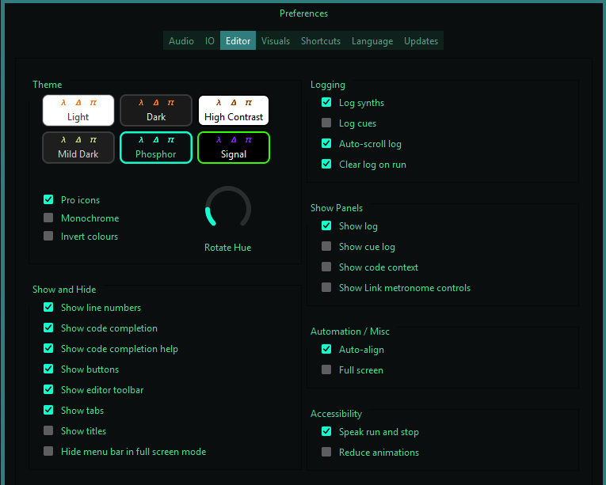
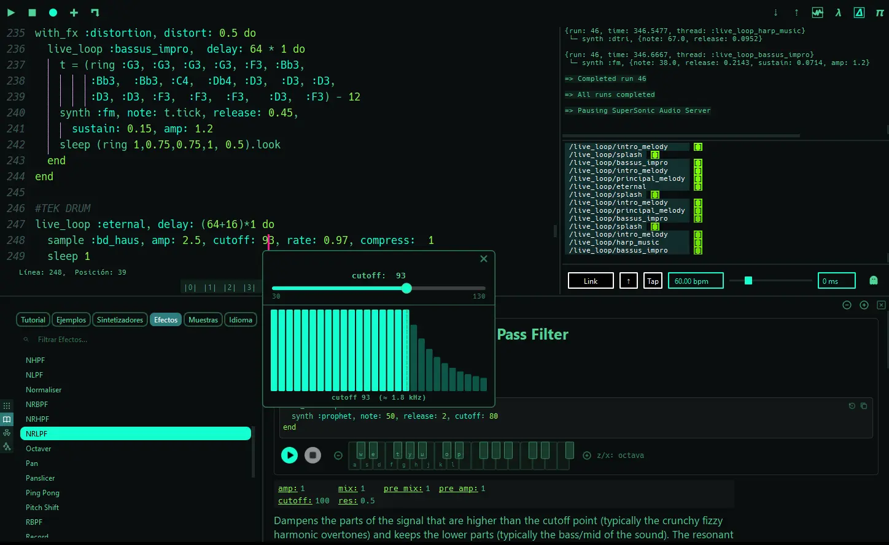
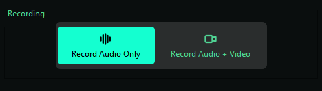
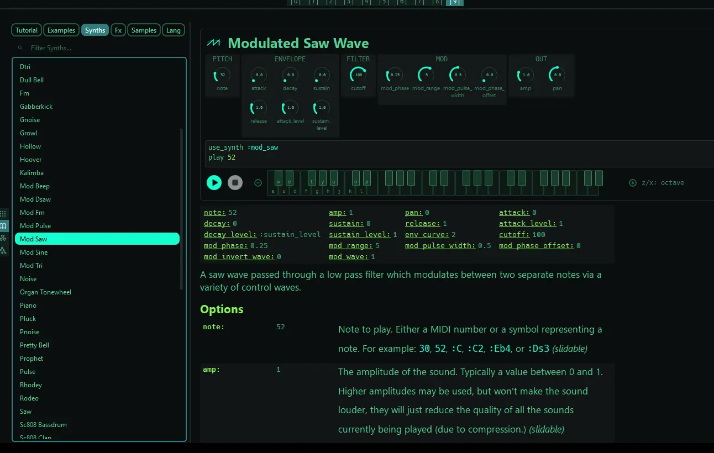
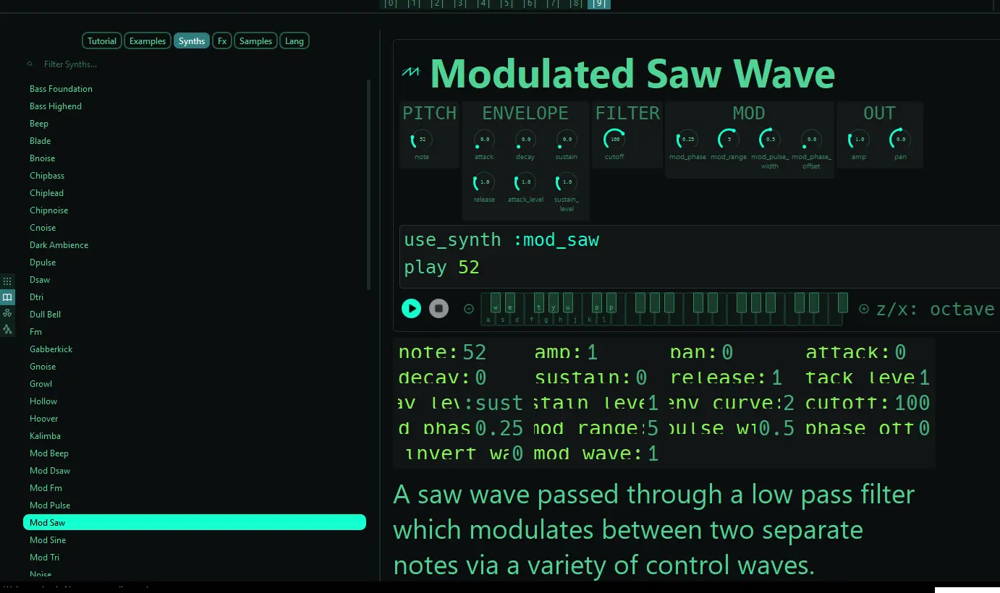
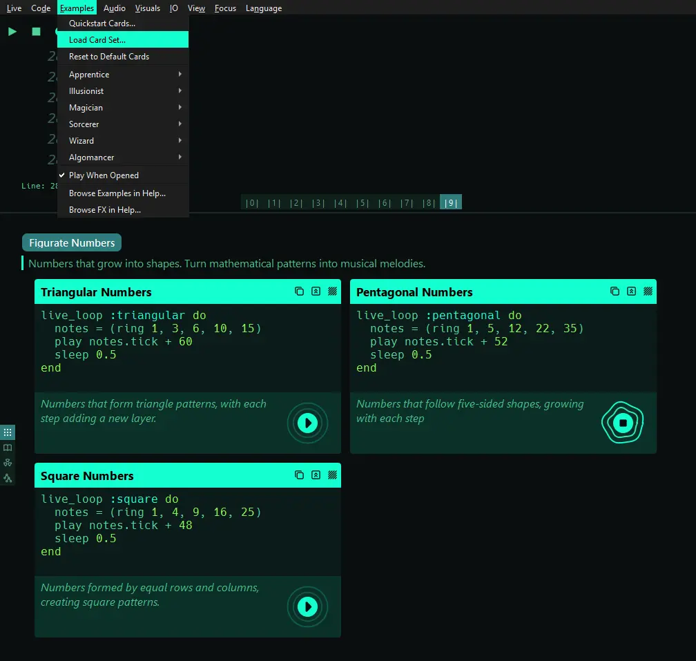
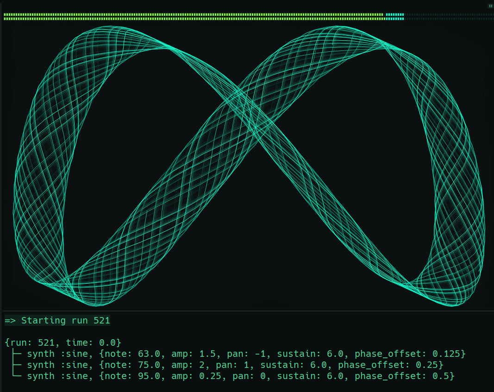

These are my first impressions of the new Sonic Pi 5 release candidate from the perspective of someone who loves live coding. I'll cover the new interface, documentation workflow, editor and audio features, some of the new musical material, and how to create your own card decks. At the end, I'll also share a small gift that some people have asked me for so they can experiment with it.

> I also tested my two **Ruby** gems, [figurate_numbers](https://rubygems.org/gems/figurate_numbers) and [modular_forms](https://rubygems.org/gems/modular_forms/versions/0.0.5), and they continue to work correctly in this version.


<details class="[&_li]:my-0 [&_ul]:my-0.5">
<summary>Contents</summary>

- [Preferences: First look at the new interface](#preferences-first-look-at-the-new-interface)
  - [Editor Visuals](#editor-visuals)
  - [Audio and Recording](#audio-and-recording)
- [The documentation is a live learning tool](#the-documentation-is-a-live-learning-tool)
  - [Interface observations](#interface-observations)
- [Music materials: new scales, samples and methods](#music-materials-new-scales-samples-and-methods)
- [Card Decks: A Tutorial](#card-decks-a-tutorial)
- [Phase and the oscilloscope](#phase-and-the-oscilloscope)
- [SuperSonic, node tree and live metrics](#supersonic-node-tree-and-live-metrics)
- [Code and performance](#code-and-performance)
- [Closing thoughts](#closing-thoughts)

</details>

## Preferences: First look at the new interface

The interface redesign also made a great impression on me. It feels more modern, cleaner, and more enjoyable to work with.



We finally have theme customization, including **hue** changes, **transparency**, **monochrome**, and **color inversion**, providing a more personalized experience. The available themes are:

| Theme         | Hover description                                  |
| ------------- | -------------------------------------------------- |
| Light         | Light colour scheme                                |
| Dark          | Dark colour scheme                                 |
| High Contrast | High-contrast colour scheme for maximum legibility |
| Mild Dark     | A softer, low contrast color scheme                |
| Phosphor      | A green-on-black CRT colour scheme                 |
| Signal        | High-contrast blue-and-gold colour scheme          |


I selected **Phosphor** for the images below. Can you guess the hue adjustment value I used? However, I think I’ll be working with **Mild Dark** on a daily basis, as it feels really comfortable and easy on the eyes.

For those who enjoy the conveniences of modern code editors, it now includes a toolbar with **Cut**, **Copy**, **Paste**, and, most importantly, **Search**.


Continuing with the interface improvements, what I found especially interesting is how the new control sliders support understanding and experimentation.



Beyond explaining the meaning of each envelope and parameter, these controls make valid ranges immediately visible, reducing trial and error and the need to consult the documentation.

For example, the visualization of `phase` in the **Echo FX** clearly defines its operating range:

$$
\textrm{phase} \in \mathbb{R}, \quad 0 \le \textrm{phase} \le 1.
$$

This kind of feedback creates a natural connection between programming and mathematical concepts such as intervals and functions.

Likewise, the visual representation of the `cutoff` through bars (visible in the image above) provides an immediate view of how **filtering changes** the frequency range, particularly the attenuation of higher frequencies, without relying only on numerical values.

### Editor Visuals

I noticed the new **dynamic event visualization** features added to the editor. Now, every triggered sound event can generate visual feedback through three customizable options, each with adjustable brightness:

- Flash code on sound trigger:
- Flash gutter on sound trigger
- Show live loop scopes
- Scrolling live loop scopes

Most interesting is the small oscilloscope and spectrum display (bar-style visualization) attached directly to the code line.

### Audio and Recording

What is immediately noticeable is the possibility to **record audio + video**. This is superb, as it removes the need for external software to capture our sessions.
There are also the audio options, such as selecting the audio device/driver, sample rate, and buffer size.



## The documentation is a live learning tool

The documentation available through the help panel using the **`F1` key** is impressive. It creates a natural bridge for people coming from music production environments, **DAWs**, and hardware synthesizers.



> Now the docs and `f1` panes are independent windows. The help pane can be moved to another monitor, allowing you to keep your live session uninterrupted while adjusting its size and zoom as needed.

The combination of **code**, **parameter controls**, **knobs**, and visual controllers connects familiar musical workflows with live coding, making experimentation between **sound design** and programming much more fluid.

For example, a `mod_saw` (**modulated saw wave**) synth allows you to explore parameters such as `mod_range` directly with the knob, preview the sound using the virtual keyboard, and then transfer the result into your live coding session. This workflow creates a natural path from experimentation to code.


### Interface observations

While exploring this **release candidate**, I noticed what might be a small interface detail related to zoom scaling. When the documentation zoom level is increased, some interface elements do not seem to adapt completely to the larger size. Some labels appear partially hidden or overlap, and the full names of certain controls are not always visible.



It is a minor detail, but perhaps it could be improved with better spacing, responsive resizing, or a horizontal scroll option. I also noticed that the text labels inside some knobs do not appear to scale with the zoom level.

Additionally, it would be great if the lists inside **`Tutorial`**, **`Examples`**, **`Synths`**, **`Fx`**, **`Samples`**, and **`Lang`** could also support text scaling for users who need better visual accessibility.

This is only a design observation from my experience using the interface, but I think these small details could make Sonic Pi even more comfortable for a wider range of users.


## Music materials: new scales, samples and methods

Using `puts scale_names`, I found some new scales available in this version:

```rb
(ring
  :acoustic,
  :altered,
  :byzantine,
  :lydian_dominant,
  :phrygian_dominant
)
```

Likewise, with `puts chord_names`, I found these new chord options:

```rb
(ring
  "7+9",
  "9-5",
  "mM7",
  "maj13",
  "min7",
  "minor_major7",
  "mmaj7"
)
```

I noticed an improvement in the explanation of `play_pattern` and `play_pattern_timed` in Tutorial section **8.2**.
There is also a new method in section **8.5** for ring chains called `invert_around`.

```rb
puts (ring 60, 64, 67).invert_around(:e4) # or 64
# (ring 68.0, 64.0, 61.0)
```

Mathematically, if $x$ is a note and $p$ is the pivot note (MIDI value or `:symbol`), the inversion is defined by

$$
\phi(x) = 2p-x.
$$

Equivalently, letting $d(x, p) = x-p$ denote the signed distance from $x$ to $p$,

$$
\phi(x) = p - d(x, p).
$$

Geometrically, this is the reflection of the note $x$ across the pivot note $p$, which acts as the axis of symmetry.
Try another note and verify the result yourself.


## Card Decks: A Tutorial

In the **Menu → Examples**, there is a `QuickStart Cards` option that opens a panel with code snippet cards. These cards allow you to **copy** the snippet, **drag** it into the code editor, and listen to it with a play button, among other features. In fact, this is a wonderful educational tool. Here I'll show you how to create your own.



> Card decks are independent windows, like the `F1` help panels

To create a personalized card deck, go to **Examples → Load Card Set...** and create a `my-example-deck.txt` file. If you try to open an empty file or one with an invalid format, you will see this message:

```txt
my-example-deck.txt is not a valid card set.
No card decks were found.
A card set needs at least one "Deck: name" line followed by "## Card title" cards
```

The format I will use for my own `figurate-numbers.txt` card deck is based on polygonal numbers

$$
\begin{array}{ccc}
S_3(n) & S_4(n) & S_5(n)\\[2mm]
\text{triangular} & \text{square} & \text{pentagonal}
\end{array}
$$

````md
# Deck: Figurate Numbers
Numbers that grow into shapes. Turn mathematical patterns into musical melodies.

## Triangular Numbers
Numbers that form triangle patterns, with each step adding a new layer.
```
live_loop :triangular do
  notes = (ring 1, 3, 6, 10, 15)
  play notes.tick + 60
  sleep 0.5
end
```

## Square Numbers
Numbers formed by equal rows and columns, creating square patterns.
```
live_loop :square do
  notes = (ring 1, 4, 9, 16, 25)
  play notes.tick + 48
  sleep 0.5
end
```

## Pentagonal Numbers
Numbers that follow five-sided shapes, growing with each step
```
live_loop :pentagonal do
  notes = (ring 1, 5, 12, 22, 35)
  play notes.tick + 52
  sleep 0.5
end
```
````

Simply keep the same structure and change the deck names, card titles, descriptions, and Sonic Pi snippets.

> A single `.txt` file can contain multiple `# Deck` sections with multiple `## Card` examples inside each one.

## Phase and the oscilloscope

One of the interesting parameters we can explore with the **Sine** synth is `phase_offset`. It lets us choose where the waveform starts inside its cycle.



Using the triangular number idea from the deck section,
you can play with different phase relationships and see their Lissajous patterns in the figure above:

```rb
triangular_notes = (ring 1, 3, 6, 10, 15, 21, 28, 35)
use_synth :sine

play triangular_notes[1] + 60,
  amp: 1.5, pan: -1,
  sustain: 6, phase_offset: 0.125

play triangular_notes[4] + 60,
  amp: 2, pan: 1,
  sustain: 6, phase_offset: 0.25

play triangular_notes[7] + 60,
  amp: 0.25, pan: 0,
  sustain: 6, phase_offset: 0.5
```

The value goes from $0$ to $1$, representing a fraction of a complete cycle (as mentioned in the docs).
Since one cycle corresponds to $360^\circ$, we can express the phase angle as:

$$
\theta = \text{phase\_offset}\times360^\circ
$$

Well, let's make an $8$-step conversion table:

| `phase_offset` | Fraction of cycle | Degrees $\theta$ | Radians          |
| -------------- | ----------------- | ---------------- | ---------------- |
| `0`            | $0$               | $0^\circ$        | $0$              |
| `0.125`        | $\frac{1}{8}$     | $45^\circ$       | $\frac{\pi}{4}$  |
| `0.25`         | $\frac{1}{4}$     | $90^\circ$       | $\frac{\pi}{2}$  |
| `0.375`        | $\frac{3}{8}$     | $135^\circ$      | $\frac{3\pi}{4}$ |
| `0.5`          | $\frac{1}{2}$     | $180^\circ$      | $\pi$            |
| `0.625`        | $\frac{5}{8}$     | $225^\circ$      | $\frac{5\pi}{4}$ |
| `0.75`         | $\frac{3}{4}$     | $270^\circ$      | $\frac{3\pi}{2}$ |
| `0.875`        | $\frac{7}{8}$     | $315^\circ$      | $\frac{7\pi}{4}$ |
| `1`            | $1$               | $360^\circ$      | $2\pi$           |

Note that mathematically `phase_offset: 1` is equivalent to `phase_offset: 0`.

## SuperSonic, node tree and live metrics

For me, one of the most impressive things is the new **SuperSonic** audio backend. I haven’t explored the full codebase yet, but the ideas behind it are fascinating.
The new audio architecture gives us a much more **engineering-oriented** view of what is happening internally. The panel now shows the live audio node tree.


| Panel      | Metrics                                   |
| ---------- | ----------------------------------------- |
| ENGINE     | Version, Rate, Block, Channels, Ticks     |
| OSC        | Sent, Recv In, RT Out, NRT Out            |
| CLOCK      | Tempo, Beat, Phase, Playing, Peers        |
| DSP        | Load, Peak, Overruns                      |
| LINK AUDIO | In, Underruns, Buffered, Drift, Publish   |
| SCSYNTH    | Msgs, Queue, Max-Last, Late Age, Debug    |
| BUFFERS    | SynthDefs, Buffers, Buf Bytes             |
| ERRORS     | Dropped, Q Drop, Seq Gaps, Lates, Corrupt |


We can also observe **`Groups`**, **`Synths`**, **`FX`**, and **`Samples`** interacting in real time within this graph structure. This makes it much easier to trace the flow of audio and see how the different components are connected during a performance.

And what you are seeing in the image above is exactly **What Is Love**. At the beginning of the track, the **sample counter** is still at zero. Now, as promised, here comes the gift.

## Code and performance

For this version, I revisited my adaptation of **["What Is Love" (Haddaway)](https://www.youtube.com/watch?v=DLPzGmeS4Xg)**, originally created several years ago (2021).

Use the copy button to quickly try the code in your own Sonic Pi session.

```ruby
##| What Is Love (HADDAWAY) for Sonic Pi

use_bpm 126

##| ARP
with_fx :reverb, mix: 0.5, room: 0.85 do
  with_fx :distortion, distort: 0.4 do
    live_loop :intro_melody do
      use_random_seed dice(4)
      a = (ring :Bb4, :A4, :Bb4, :G4)
      b = (ring :Bb4, :A4, :Bb4, :F4)
      c = (ring :A4, :G4, :A4, :F4)
      synth :chiplead, note: (knit a.tick, 8, b.look, 8, c.look, 16).look,
        release: rrand(0.15, 0.25), sustain: 0.1, attack: 0,
        decay: 0, amp: 0.4
      sleep 0.5
    end
  end
end

##|HARMONY
with_fx :reverb, mix: 0.5, room: 0.9 do
  live_loop :chords, delay: 16, sync: :intro_melody do
    with_fx :slicer, phase: 0.75 do
      use_synth :dsaw
      chordas = [(ring :G4,:BB4,:D4), (ring :F4,:BB4,:D4),
                 (ring :F4,:A4,:D4), (ring :F4,:A4,:C4)].tick
      play chordas, amp: 0.75, sustain: 3, attack: 0.25,  release: 0.25
      sleep 4
    end
  end
end

##|SPLASH
with_fx :panslicer, invert_wave: 1, phase: 1.0/4 do
  live_loop :splash,  delay: 32 * 1 do
    use_random_seed 43
    sample :ambi_lunar_land, release: 0.25, amp: rrand(0.2,0.3)*1
    sleep 0.5
  end
end

##| BEEPFUSION
with_fx :reverb, mix: 0.3, room: 0.7 do
  with_fx :echo, mix: 1, phase: 0.5 do
    live_loop :harp_music, delay: 48*1 do
      use_random_seed 123
      8.times do
        tick
        with_fx :panslicer, phase: 0.75, invert_wave: [1,0].choose do
          p = (ring :G4, :Bb4, :A4, :F4)
          synth :dtri, note: p.choose, release: 0.2
          sleep (ring 0.25,0.75,0.5).look
        end
      end
    end
  end
end

##| BASS GROOVE
with_fx :distortion, distort: 0.5 do
  live_loop :bassus_impro,  delay: 64 * 1 do
    t = (ring :G3, :G3, :G3, :G3, :F3, :Bb3,
         :Bb3,  :Bb3, :C4,  :Db4, :D3,  :D3, :D3,
         :D3, :D3, :F3,  :F3,  :F3,   :D3,  :F3) - 12
    synth :fm, note: t.tick, release: 0.45,
      sustain: 0.15, amp: 1.2
    sleep (ring 1,0.75,0.75,1, 0.5).look
  end
end

##| TEK DRUM
live_loop :eternal, delay: (64+16)*1 do
  sample :bd_haus, amp: 2.5, cutoff: 93, rate: 0.97, compress:  1
  sleep 1
end

##| DRUMS
live_loop :bom, delay: (64 + 32)*1 do
  sample :bd_sone, amp: 1, compress: 1, rate: 1.7
  sleep 1
  with_fx :reverb, mix: 0.2, room: 0.14 do
    sample :sn_dolf,  amp: [1,1].tick
    sleep 1
  end
end

##| SING THE MELODY
with_fx :reverb, room: 0.5, mix: 0.8 do
  with_fx :ping_pong, mix: rrand(0.55,0.6), amp: 0.5, phase: 0.25 do
    with_fx :echo, phase: 0.25, mix: 0.5, pre_mix: 1, max_phase: 1, decay: 1.5 do
      with_fx :distortion, mix: 0.2, distort: 0.8 do
        live_loop :principal_melody, delay: (64 + 64)*1 do
          melody = [:r, :D4, :Eb4, :D4, :F4, :D4,
                    :D4, :F4, :D4, :D4, :C4, :D4, :F4, :G4]
          sleep_m = [2,0.5,0.5,0.5,1,2.5,0.5,1,2.5,0.5,3,0.5,0.5,0.5].ring
          synth :supersaw, note: melody.tick, amp: 0.6, release: 0.35, sustain: 0.2
          sleep sleep_m.look
        end
      end
    end
  end
end
```

## Closing thoughts

Many thanks to [**Sam Aaron**](https://www.patreon.com/samaaron/posts/sonic-pi-v5-1-164093369) and the entire [**Sonic Pi**](https://in-thread.sonic-pi.net/) community for continuing to shape and evolve this amazing creative instrument.

