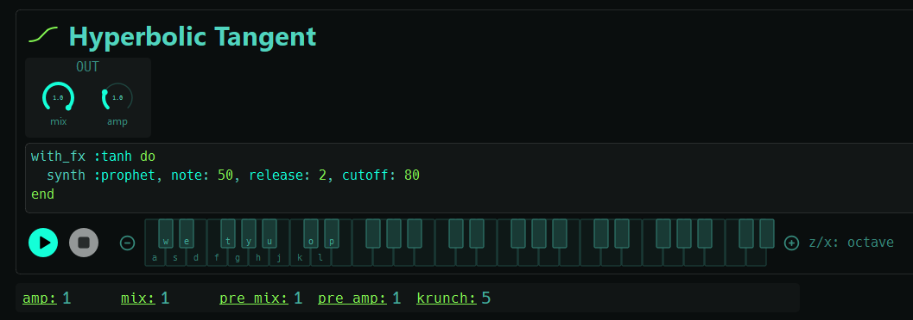
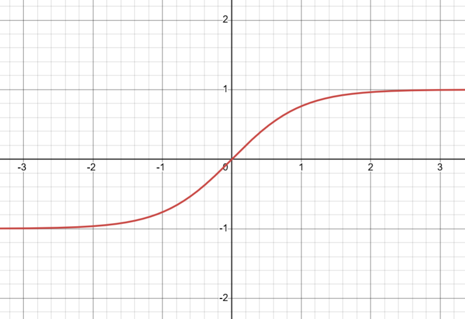
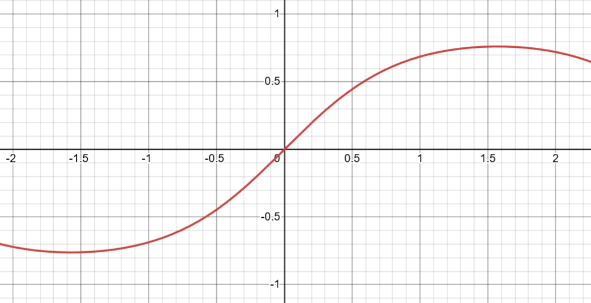
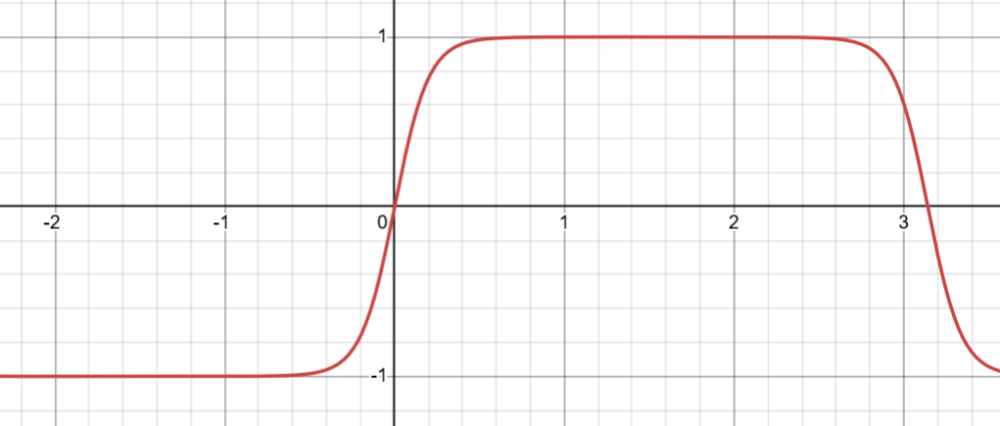
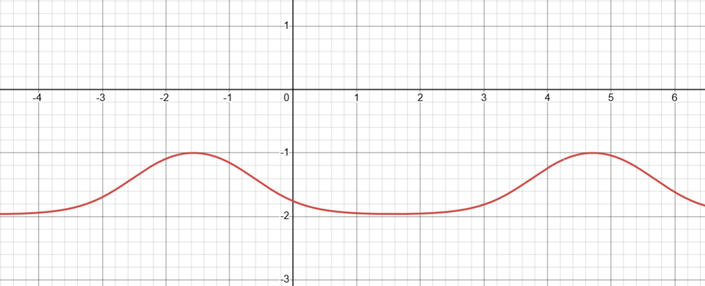

Dentro de las muchas funciones que se ven en Cálculo de editorial *NO MIRES* está la función que encuentras al despertar de cada día, sí, la función tangente hiperbólica que aparece cuando quieres el efecto `with_fx :tanh` en Sonic Pi 5.

Y sonoramente produce una especie de sonido distorsionado, si hablamos en términos muy livianos.

Pues antes que nada y que todo por aquí, no entraré en detalle y solo haremos un sofrito con esto, anquilosémonos en la variable real $f:\mathbb{R} \rightarrow \mathbb{R}$. Vamos al meollo básico del efecto en su forma ideal.

> *Spoiler*: La implementación precisa de parámetros en Sonic Pi se puede extraer desde el código fuente mediante el análisis del grafo `.dot` del `synthdef`.

## Relleno de la causa

Matemáticamente la escribes así: $\tanh(x)$. Iba a usar GeoGebra, pero quedémonos en Desmos. El gráfico real de la función se ve de la siguiente manera:

De aquí deducimos (al ojo) raudamente que su dominio es $\operatorname{Dom}(f) = \mathbb{R}$ y la imagen es $\operatorname{Im}(f)=(-1,1)$.

Pero, ¿cómo se define con mejor claridad esta función? Llamemos a Taylor, el de las series (Maclaurin porque es en cero entre nosotros). Series y más series de Netflix. Recordemos que, por las definiciones clave de cálculo, la tangente hiperbólica puede mirarse como un bonito cociente de dos ondas:

$$
\sinh(x)
= x + \frac{x^3}{\Gamma(4)} + \frac{x^5}{\Gamma(6)} + \cdots
$$

$$
\cosh(x)
= 1 + \frac{x^2}{\Gamma(3)} + \frac{x^4}{\Gamma(5)} + \cdots
$$

> La función Gamma debe emanar y replicarse en las series a borbotones.

Y la jugada consiste en dividirlas (alrededor de $x=0$) como

$$
\begin{aligned}
\tanh(x)
&= \frac{\sinh(x)}{\cosh(x)}
\\
&= x - \frac{x^3}{3}
+ \frac{2x^5}{15}
\\
&\quad - \frac{17x^7}{315}
+ \frac{62x^9}{2835}
\\
&\quad
 - \frac{1382x^{11}}{155925}
+ \frac{21844x^{13}}{6081075}
\\
&\quad
+ \cdots
\end{aligned}
$$

Poco a poco, comenzamos a ver que hay cuestiones aritméticas, como lo impar de unas medias que no tienen fin.

## Continuidad

En el mundo digital, las cosas son discretas, por lo que usaremos una onda senoidal continua (esto fue a propósito y con despropósito)

$$
\vartheta(x) = \tanh(\sin(x)),
$$

que se ve como la figurita sin sobre.

La senoidal $\vartheta(x)$ está aplastada y llega en imagen hasta los reales (¿a alguien le parecen bien estos números aproximados?) $\pm 0.761594\ldots$.

Como somos curiosos, nos hacemos la pregunta: ¿No es prácticamente lo mismo, pero con menor amplitud?
Bien, agreguemos un toque de piña, un $\kappa=5$, que modificará el empuje por dentro:

$$
\vartheta(x) = \tanh(5\sin(x))
$$

Y ahora sí aparece el truco del mago Giorhini.

La foto muestra la evolución en una onda cuadriculada (como las hojas del cuaderno).
Hubo un estirón en la zona alrededor del $\pm 1$ y una compresión en la zona intermedia. Ponle toda la piña a $\kappa$ y mira qué te aparece.

De hecho, si ponemos todas las piñas del universo,

$$
\lim_{\kappa \rightarrow \infty} \tanh(\kappa\sin(x))
= \operatorname{sgn}(\sin(x)),
$$

para los puntos donde $\sin(x)\neq 0$.
¿Así o más cuadrado?

## Hacia la cuadratura del senoidal

> Asumiremos que la amplitud $A$ de la onda seno está normalizada, es decir, $A=1$.

Todo tiene una co-razón de ser. Voy a agregar algo más, la aceituna (a algunas personas no les gusta)

$$
\vartheta(x) = \tanh(\kappa \sin(\phi x)).
$$

Si $x$ representa tiempo, $\phi$ es la frecuencia angular y se relaciona con la frecuencia $f$ mediante  $\phi = 2\pi f$.
Basta con substituir los dos primeros términos en la serie de más arriba y tenemos

$$
\vartheta(x)
\approx
\kappa\sin(\phi x)
-
\frac{\kappa^3\sin^3(\phi x)}{3}.
$$

Recordemos que

$$
\sin(3x) = 3\sin(x) - 4\sin^3(x)
$$

que con su despeje estival de cielo limeño sale

$$
4\sin^3(x) = 3\sin(x) - \sin(3x).
$$

Antes de proceder, inyectamos $\phi$. Así, llegamos al invierno que es verano 2026 nuevamente

$$
\sin^3(\phi x)
=
\frac{3\sin(\phi x)-\sin(3\phi x)}{4}.
$$

Con esto nos caemos para atrás viendo que tiene tanto la frecuencia $f$ como la frecuencia $3f$. Seguimos en cabina

$$
\begin{aligned}
\sin^5(\phi x)
&=
\frac{10\sin(\phi x)}{16}
\\
&\quad
-\frac{5\sin(3\phi x)}{16}
\\
&\quad
+\frac{\sin(5\phi x)}{16}.
\end{aligned}
$$

Lo que produce los parciales $f, 3f, 5f$. Si ya se acabó la media hora en cabina, la cosa sigue igual, el siguiente será

$$
f, 3f, 5f, 7f, \ldots, (2N+1)f,
$$

con $N \in \mathbb{N}$.

Sí, si truncamos las cosas.

> Para recordar de dónde salen estas identidades, debes contactar por videollamada a Newton con el binomio ese de álgebra, pero para potencias mayores y desde la exponencial (solo para usuarios avanzados).

## Moviendo el bote

Podemos dejar $\phi=1$ para simplificar y, si tomamos $\kappa<0$, la no linealidad invierte el sentido de la señal.
O mucho mejor, con una **saturación asimétrica**.

Hemos soltado en la pista el prohibido:

$$
\vartheta(x)
=
\alpha\tanh\!\bigl(\kappa A\sin(\phi x)+b\bigr)+c.
$$

Para no perder de oído quién mueve qué potenciómetro bailable, tenemos la siguiente mesa del **DJ**.

| Parámetro | ¿Qué me estás contando?                                                                   |
| :-------: | :---------------------------------------------------------------------------------------- |
|    $A$    | Amplitud de la onda seno. Si está normalizada, $A=1$                                      |
|  $\phi$   | Controla la **frecuencia angular** de la onda seno                                        |
| $\kappa$  | Controla cuánto empujamos la señal hacia la **saturación** de $\tanh$                     |
|    $b$    | ***Bias*** interno : desplaza la señal **antes** de pasar por la transformación no lineal |
| $\alpha$  | Controla la amplitud o ganancia de salida después de aplicar $\tanh$                      |
|    $c$    | ***DC-offset*** : desplaza la señal **después** de la transformación no lineal            |

Perfecto, $A$ y $\phi$ preparan el baile ondulante de la onda seno, $\kappa$ decide con qué pasión cartesiana y cuánto la estrujamos contra la saturación.

Por su parte, $b$ la mueve antes de comerse su **monstrito** no lineal.
Es probablemente el más interesante, puesto que rompe la simetría y puede hacer aparecer más armónicos, incluso armónicos pares.

Y para cerrar el circuito, $\alpha$ y $c$ (el universo **DC**, Batman y Superman) se encargan de lo que sale por el otro lado de la película.

