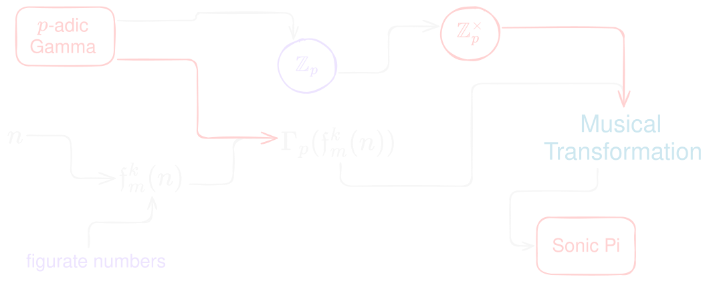

I often like to think about the same mathematical object through different representations, e.g. musical, geometric, arithmetic, combinatorial, [type-theoretic](https://edelveart.github.io/blog/category-of-modules-and-type-level-programming-with-figurate-numbers/), and so on.
One notion that has fascinated me ever since [Emil Artin's book](https://ncatlab.org/nlab/files/Artin-TheGammaFunction.pdf), dedicated entirely to the **Gamma function** $\Gamma$, keeps showing up in definitions across different contexts.

I'll reproduce here some material from my earlier [post](https://edelveart.github.io/blog/generators-as-symbolic-exploration/).
These formulas for the hypertetrahedral numbers will not be particularly useful for what follows, but they are what led me here.

$$
H_k(n)=\frac{n(n+1) \cdots (n + k - 1)}{k(k-1)(k-2) \cdots 1}
$$

$$
= \frac{ \prod_{i=0}^{k-1} (n + i)}{ \prod_{i=0}^{k-1} (k-i)} =  \frac{n^{\overline{k}}}{k^{\underline{k}}}
$$

$$
= \frac{\dfrac{\Gamma(n + k)}{\Gamma(n)}}{\Gamma(k + 1)} = \frac{\Gamma(n + k)}{\Gamma(n) \, \Gamma(k + 1)}
$$

$$
= \frac{n^{\overline{k}}}{k!}
= \binom{n + k - 1}{k}
$$

$$
 =  \frac{\displaystyle \int_0^\infty \tau^{n+k-1} e^{-\tau} \ d\tau}
{\displaystyle \left( \int_0^\infty \tau^{n-1} e^{-\tau} \ d\tau \right) \left( \int_0^\infty \tau^k e^{-\tau} \ d\tau \right)}.
$$

Yes, there's a bit of a joke in it, and also something of that trivial kind of orbit where you just look at the same object from every angle.
To try out this river of equivalences, you can install my library

```shell
gem install figurate_numbers
```

and call

```rb
require "figurate_numbers"

gen = FigurateNumbers.k_dimensional_hypertetrahedron(57)
k_100_hypertetrahedron_num = gen.take(10)
# [1, 58, 1711, 34220, 521855, 6471002, 67945521, 621216192,
# 5047381560, 37014131440]
```

But I also think a lot about deformed objects built on top of these combinatorial geometries. That's where we get to the second point.

## On Gamma

`figurate_numbers` already has a module called `ArithTransform`, which includes p-adic methods you can call like this

```rb
ArithTransform.padic_val(n, p)
ArithTransform.ring_padic_val(seq, p)
ArithTransform.padic_norm(n, p)
ArithTransform.ring_padic_norm(seq, p)
ArithTransform.padic_expansion(n, p, precision = 11, reverse: false)
ArithTransform.ring_padic_expansion(seq, p, precision = 11, reverse: false)
```

And naturally, I'd been waiting a while to think about adding the **p-adic Gamma function** too.

Let's set things up. Let $\mathfrak{f}_{m}^{k}(n)$ denote the figurate sequence, where $m \ge 3$ is the number of sides and $k \ge 2$ is the dimension.

In simple words, what I'm after is simply


<!-- $$
n \longmapsto \mathfrak{f}_{m}^{k}(n) \longmapsto \Gamma_p(\mathfrak{f}_{m}^{k}(n))
$$ -->

### A bit of literature

The definition below comes from a number theory question posted on [MathOverflow](https://mathoverflow.net/questions/383272/computing-the-p-adic-gamma-function-gamma-p) five and a half years ago about computing this.
The question was answered by *Henri Cohen*, who points to his own book, specifically [Chapter 11 of GTM 240](https://link.springer.com/chapter/10.1007/978-0-387-49894-2_3).

As he mentions in the **abstract**, he thanks F. Rodriguez-Villegas for the script in [GP](https://pari.math.u-bordeaux.fr/) used to compute this function.

That said, since this is just a sketch, I'll leave **optimization aside** and think only about computing the first few values. The algorithm will be a naive one.

## The p-adic side

The definition for integers $n$ (please use **non-generalized figurate numbers**; you've been warned, but do the opposite if you feel like it), and taking $p=3$ from here on (as if everything just happened to fit), is simply expressed as an arithmetic function with a product, going from $\mathbb{Z}_p \rightarrow \mathbb{Z}_p^{\times}$, like this:

$$
\Gamma_p(n) = (-1)^n
\prod_{\substack{1 \ \le \ j \  < n \\ p \ \nmid \ j}} j .
$$

Finally, all that's left is to bend the geometry of the figurate numbers to the p-adic Gamma.

## Letting the Naive Algorithm Run

In the end, since I'm also fascinated by the question of iteration, I figure we could add some refinements with a magnifying glass.

$$
 \Gamma_p(\mathfrak{f}_{m}^{k}(n)) \pmod{p^r}
$$

> For positive integer inputs, the product formula gives an ordinary integer value. This value is naturally regarded as an element of $\mathbb{Z}_p^\times$, and reducing it modulo $p^r$ gives a finite-precision approximation, which can then be expressed in base $p$.

So here's the algorithm, quite succinct and direct, without worrying about the cost of all those repeated multiplications:

```rb
def gamma_p_mod(n, p, r)
  raise ArgumentError, "n must be >= 1" if n < 1
  raise ArgumentError, "p must be >= 3" if p < 3
  raise ArgumentError, "r must be >= 1" if r < 1

  modulo = p ** r
  product = 1

  (1...n).each do |j|
    if j % p != 0
      product = (product * j) % modulo
    end
  end

  sign = n.even? ? 1 : -1

  (sign * product) % modulo

end
```

Yes, the argument checks are enough for this sketch. For the sake of simplicity, I'll only require $p \ge 3$ here and leave primality aside.
Or better, **get confused** and see how it goes during your live coding session.

## Sonic Pi of the Park Birds

Finally, **Sonic Pi v5** just came out recently (you can check out my [post](https://edelveart.github.io/blog/sonic-pi-5-rc-first-impressions-with-what-is-love/) on what's new, and the fix I made).

First of all, make sure you find the `PATH` to the gem file in your system (see my example).
Well then, here's the algorithm, introducing Euclidean rhythms. Let's begin with the hypertetrahedral numbers $S_3^4(n)$.

```rb
require "<PATH>/lib/figurate_numbers.rb"
#require "C:/Ruby33-x64/lib/ruby/gems/3.3.0/gems/figurate_numbers-1.5.3/lib/figurate_numbers.rb"

hypertetra = FigurateNumbers.hypertetrahedral.take(50)
p = 3
r = 2
live_loop :padic_gamma do
  use_synth :fm
  n = hypertetra.ring.tick
  play gamma_p_mod(n, p, r) + 60,
    decay: 0.1,
    release: 0.125,
    divisor: 100 if (spread 3,5).look
  sleep 0.125
end
```

If we bump `p=7`, we get a kind of Sunday dawn birdsong sound, it's mostly just an effect. Also, be careful when changing `take(N)`, for a relatively large value, you'll see the algorithm start to fail.

## Closure

When will I put this up? At some point I'll add new functionality to the library. I think most of the interesting questions about $\Gamma_p$ will arrive in their own, non-computational time.
